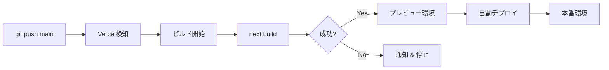
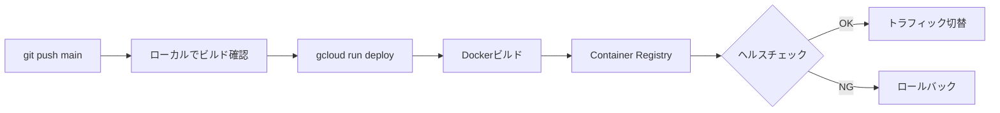

# Video Analyzer V2 - デプロイ設計書

## 📋 目次
1. [アーキテクチャ概要](#アーキテクチャ概要)
2. [環境構成](#環境構成)
3. [デプロイフロー](#デプロイフロー)
4. [環境変数管理](#環境変数管理)
5. [モニタリング戦略](#モニタリング戦略)
6. [スケーリング戦略](#スケーリング戦略)
7. [セキュリティ](#セキュリティ)
8. [ロールバック手順](#ロールバック手順)
9. [トラブルシューティング](#トラブルシューティング)

---

## アーキテクチャ概要

```
┌─────────────────────────────────────────────────────────────┐
│                         ユーザー                              │
└─────────────────────────────────────────────────────────────┘
                              │
                              ▼
┌─────────────────────────────────────────────────────────────┐
│                    Vercel (Next.js 14)                       │
│  ┌─────────────────────────────────────────────────────┐    │
│  │  - フロントエンド (React)                            │    │
│  │  - API Routes (/api/*)                              │    │
│  │  - 認証 (Clerk)                                      │    │
│  │  - Blob Storage管理                                  │    │
│  └─────────────────────────────────────────────────────┘    │
└─────────────────────────────────────────────────────────────┘
                              │
                              ▼
                    ┌──────────────────┐
                    │  Vercel Blob     │
                    │  (動画・Excel)    │
                    └──────────────────┘
                              │
                              ▼
┌─────────────────────────────────────────────────────────────┐
│              Google Cloud Run (Worker)                       │
│  ┌─────────────────────────────────────────────────────┐    │
│  │  - Express.js サーバー                               │    │
│  │  - FFmpeg (シーン検出)                               │    │
│  │  - Gemini API (OCR)                                  │    │
│  │  - OpenAI Whisper (音声認識)                         │    │
│  │  - Excel生成                                          │    │
│  └─────────────────────────────────────────────────────┘    │
└─────────────────────────────────────────────────────────────┘
                              │
                              ▼
                    ┌──────────────────┐
                    │  Supabase        │
                    │  (ステータス管理)  │
                    └──────────────────┘
```

---

## 環境構成

### 1. 開発環境 (Development)

**フロントエンド:**
- URL: http://localhost:3001
- 環境: Node.js 24.10.0
- データベース: なし (in-memory)
- ストレージ: `/tmp` (ローカルファイル)

**バックエンド:**
- URL: http://localhost:8080
- 環境: Node.js 24.10.0
- データベース: なし (in-memory)

**環境変数:**
```bash
NODE_ENV=development
USE_SUPABASE=false
CLOUD_RUN_URL=http://localhost:8080
```

### 2. 本番環境 (Production)

**フロントエンド:**
- プラットフォーム: Vercel
- URL: https://video-analyzer-v2.vercel.app (推定)
- リージョン: Auto (CDN)
- Node.js: 20.x (Vercel推奨)

**バックエンド:**
- プラットフォーム: Google Cloud Run
- URL: https://video-analyzer-worker-820467345033.us-central1.run.app
- リージョン: us-central1
- スペック:
  - CPU: 1 vCPU
  - メモリ: 2 GiB
  - タイムアウト: 600秒
  - 最大インスタンス: 10

**環境変数:**
```bash
NODE_ENV=production
USE_SUPABASE=true
```

---

## デプロイフロー

### フロントエンド (Vercel)



**手順:**
1. `git push origin main`
2. Vercelが自動検知してビルド開始
3. ビルド成功後、本番環境に自動デプロイ
4. デプロイ完了通知 (GitHub / Slack)

**デプロイコマンド (手動):**
```bash
# Vercel CLIでデプロイ
vercel --prod
```

### バックエンド (Cloud Run)



**手順:**
1. ローカルでビルド確認: `npm run build`
2. Cloud Runにデプロイ:

```bash
cd cloud-run-worker

gcloud run deploy video-analyzer-worker \
  --source . \
  --region us-central1 \
  --platform managed \
  --allow-unauthenticated \
  --memory 2Gi \
  --cpu 1 \
  --timeout 600 \
  --max-instances 10 \
  --set-env-vars \
"BLOB_READ_WRITE_TOKEN=${BLOB_READ_WRITE_TOKEN},\
SUPABASE_URL=${SUPABASE_URL},\
SUPABASE_SERVICE_ROLE_KEY=${SUPABASE_SERVICE_ROLE_KEY},\
OPENAI_API_KEY=${OPENAI_API_KEY},\
GEMINI_API_KEY=${GEMINI_API_KEY},\
WORKER_SECRET=${WORKER_SECRET},\
NODE_ENV=production"
```

**デプロイ前チェックリスト:**
- [ ] ローカルテスト成功
- [ ] `npm run build` 成功
- [ ] 環境変数が最新
- [ ] Dockerfileが正しい
- [ ] `.dockerignore` が設定済み

---

## 環境変数管理

### フロントエンド (Vercel)

**必須変数:**
```bash
# Clerk認証
NEXT_PUBLIC_CLERK_PUBLISHABLE_KEY=pk_test_...
CLERK_SECRET_KEY=sk_test_...

# Vercel Blob
BLOB_READ_WRITE_TOKEN=vercel_blob_rw_...

# Cloud Run Worker
CLOUD_RUN_URL=https://video-analyzer-worker-820467345033.us-central1.run.app
WORKER_SECRET=4MeGFIt36xoh1GdGLu9jnYLVX90BuzJqGrytHGjeNMw=

# Supabase
NEXT_PUBLIC_SUPABASE_URL=https://gcwdkjyyhmqtrxvmvnvn.supabase.co
NEXT_PUBLIC_SUPABASE_ANON_KEY=eyJhbGci...
SUPABASE_SERVICE_ROLE_KEY=eyJhbGci...

# モード
NODE_ENV=production
```

**設定方法:**
1. Vercel Dashboard → Project → Settings → Environment Variables
2. 本番環境に各変数を設定
3. Redeploy

### バックエンド (Cloud Run)

**必須変数:**
```bash
# Vercel Blob
BLOB_READ_WRITE_TOKEN=vercel_blob_rw_...

# Supabase
SUPABASE_URL=https://gcwdkjyyhmqtrxvmvnvn.supabase.co
SUPABASE_SERVICE_ROLE_KEY=eyJhbGci...

# AI API
OPENAI_API_KEY=sk-svcacct-...
GEMINI_API_KEY=<GEMINI_API_KEY>

# 認証
WORKER_SECRET=4MeGFIt36xoh1GdGLu9jnYLVX90BuzJqGrytHGjeNMw=

# モード
NODE_ENV=production
```

**設定方法:**
```bash
gcloud run services update video-analyzer-worker \
  --region us-central1 \
  --update-env-vars "VARIABLE=value"
```

**セキュリティ:**
- Secret Managerの使用を推奨（詳細は[Secret Manager移行ガイド](#secret-manager移行ガイド)参照）

---

## モニタリング戦略

### 実装済みモニタリング（2025-11-02）

**ディレクトリ:** `monitoring/`

包括的なモニタリングソリューションを実装しました:
- 6つのアラートポリシー（エラーレート、レイテンシー、リソース使用率など）
- 3つのログベースメトリクス
- Cloud Monitoringダッシュボード（8パネル）
- 自動ヘルスチェックスクリプト
- 自動セットアップスクリプト

詳細: [monitoring/README.md](./monitoring/README.md)

### フロントエンド (Vercel)

**メトリクス:**
- デプロイ成功率
- ビルド時間
- エッジ関数エラー率
- レスポンスタイム

**モニタリング方法:**
- Vercel Analytics (標準)
- Vercel Logs
- `/api/health` エンドポイント監視
- Uptime Check（5分間隔）
- カスタムヘルスチェックスクリプト

**ヘルスチェックエンドポイント:**
```
GET https://video-analyzer-v2-web.vercel.app/api/health
```

### バックエンド (Cloud Run)

**メトリクス:**
- リクエスト数
- エラー率（閾値: 5%）
- レイテンシー (p50, p95, p99) - 閾値: p95 > 60秒
- CPU使用率（閾値: 90%）
- メモリ使用率（閾値: 85%）
- インスタンス数（閾値: 9/10）

**モニタリング方法:**
- Cloud Monitoring（標準）
- Cloud Logging
- アラートポリシー（自動通知）
- ダッシュボード（リアルタイム可視化）
- Uptime Check（5分間隔）

**ログ確認:**
```bash
# リアルタイムログ
gcloud run services logs tail video-analyzer-worker \
  --region us-central1

# エラーログのみ
gcloud run services logs read video-analyzer-worker \
  --region us-central1 \
  --filter "severity>=ERROR" \
  --limit 50

# または monitoring スクリプトを使用
npx tsx monitoring/health-check.ts
```

**セットアップ:**
```bash
# 自動セットアップスクリプトを実行
./monitoring/setup-monitoring.sh

# ダッシュボード確認
open "https://console.cloud.google.com/monitoring/dashboards?project=video-analyzer-worker"
```

**アラートポリシー（6種類）:**
1. エラーレート > 5%
2. レスポンスタイム (p95) > 60秒
3. メモリ使用率 > 85%
4. CPU使用率 > 90%
5. インスタンス数 >= 9
6. Vercel Blob容量 > 800MB

各アラートには対応手順のドキュメントが含まれています。

**ログベースメトリクス（3種類）:**
- `error_log_counter` - ERROR以上のログカウント
- `video_processing_completed` - 処理完了ジョブ数
- `video_processing_failed` - 処理失敗ジョブ数

---

## スケーリング戦略

### フロントエンド (Vercel)

**自動スケーリング:**
- Vercelが自動でスケール
- CDNキャッシュ活用
- エッジ関数の地理的分散

**最適化:**
- Next.js Image最適化
- 静的サイト生成 (SSG)
- ISR (Incremental Static Regeneration)

### バックエンド (Cloud Run)

**スケーリング設定:**
```bash
gcloud run services update video-analyzer-worker \
  --region us-central1 \
  --min-instances 0 \      # コールドスタート許容
  --max-instances 10 \     # 最大10インスタンス
  --concurrency 80         # 1インスタンスあたり80リクエスト
```

**コスト最適化:**
- `min-instances=0`: アイドル時は課金なし
- `max-instances=10`: 過剰なスケールを防止
- タイムアウト600秒: 長時間処理に対応

**パフォーマンス最適化:**
- CPU: 1 vCPU (動画処理に必要)
- メモリ: 2 GiB (FFmpeg + AI処理)
- 同時実行: 80 (I/Oバウンド処理)

---

## セキュリティ

### 認証・認可

**フロントエンド:**
- Clerk認証 (ユーザー管理)
- セッションベース認証
- CSRF保護

**バックエンド:**
- WORKER_SECRET認証 (API間通信)
- Bearer token検証
- リクエスト発信元検証

**実装:**
```typescript
// cloud-run-worker/src/index.ts
const validateAuth = (req: Request, res: Response, next: Function): void => {
  const authHeader = req.headers.authorization;
  const token = authHeader?.replace('Bearer ', '');

  if (!token || token !== workerSecret) {
    res.status(401).json({ error: 'Unauthorized' });
    return;
  }

  next();
};
```

### データ保護

**Blob Storage:**
- 自動クリーンアップ (処理完了後即削除)
- アクセストークン管理
- 有効期限付きURL

**データベース:**
- Supabase RLS (Row Level Security)
- サービスロールキーの制限
- 最小権限原則

### ネットワーク

**Cloud Run:**
- HTTPS強制
- `--allow-unauthenticated` (内部認証で保護)
- VPC Connector (オプション)

**Vercel:**
- 自動HTTPS
- DDoS保護
- ファイアウォール (Enterprise)

---

## ロールバック手順

### フロントエンド (Vercel)

**手順:**
1. Vercel Dashboard → Deployments
2. 安定バージョンを選択
3. "Promote to Production" をクリック

**CLI:**
```bash
# デプロイ履歴確認
vercel ls

# 特定デプロイにロールバック
vercel rollback <deployment-url>
```

### バックエンド (Cloud Run)

**手順:**
```bash
# リビジョン一覧
gcloud run revisions list \
  --service video-analyzer-worker \
  --region us-central1

# トラフィックを前のリビジョンに戻す
gcloud run services update-traffic video-analyzer-worker \
  --region us-central1 \
  --to-revisions video-analyzer-worker-00001=100
```

**緊急ロールバック:**
```bash
# 前のリビジョンに即座に切り替え
gcloud run services update-traffic video-analyzer-worker \
  --region us-central1 \
  --to-revisions LATEST=0,video-analyzer-worker-00001=100
```

---

## トラブルシューティング

### よくある問題

#### 1. Cloud Run デプロイ失敗

**症状:**
```
ERROR: Revision 'video-analyzer-worker-00003-vzh' is not ready
```

**原因:**
- ヘルスチェック失敗
- ポート8080でリッスンしていない
- 環境変数不足

**解決策:**
```bash
# ログ確認
gcloud run services logs tail video-analyzer-worker --region us-central1

# ローカルでDockerビルド確認
docker build -t test-worker -f cloud-run-worker/Dockerfile cloud-run-worker
docker run -p 8080:8080 -e NODE_ENV=production test-worker

# ヘルスチェック確認
curl http://localhost:8080/health
```

#### 2. Vercel Blob容量オーバー

**症状:**
```
Vercel Blob: Storage quota exceeded for Hobby plan (1GB maximum)
```

**解決策:**
```bash
# 手動クリーンアップ
npx dotenv -e .env.local tsx scripts/cleanup-blob-storage.ts delete-all

# 自動クリーンアップ確認
# → videoProcessor.ts と download API で自動削除されているか確認
```

#### 3. 環境変数が反映されない

**Vercel:**
```bash
# 環境変数確認
vercel env ls

# 環境変数追加
vercel env add VARIABLE_NAME

# 再デプロイ
vercel --prod
```

**Cloud Run:**
```bash
# 環境変数確認
gcloud run services describe video-analyzer-worker \
  --region us-central1 \
  --format="value(spec.template.spec.containers[0].env)"

# 環境変数更新
gcloud run services update video-analyzer-worker \
  --region us-central1 \
  --update-env-vars "VARIABLE=value"
```

#### 4. コールドスタート遅延

**症状:**
初回リクエストが30秒以上かかる

**解決策:**
```bash
# 最小インスタンス数を1に設定 (有料)
gcloud run services update video-analyzer-worker \
  --region us-central1 \
  --min-instances 1

# または、Cloud Schedulerで定期的にウォームアップ
gcloud scheduler jobs create http warm-up-worker \
  --schedule "*/5 * * * *" \
  --uri "https://video-analyzer-worker-820467345033.us-central1.run.app/health"
```

---

## デプロイチェックリスト

### デプロイ前

- [ ] ローカルテスト成功
- [ ] TypeScriptビルド成功
- [ ] 環境変数確認
- [ ] `.env.local` と本番環境の差異確認
- [ ] GEMINI_API_KEYが設定されているか確認
- [ ] Blob自動削除機能が動作しているか確認

### デプロイ後

- [ ] ヘルスチェック成功
- [ ] フロントエンドアクセス確認
- [ ] バックエンドアクセス確認
- [ ] ログにエラーがないか確認
- [ ] 動画アップロード → 処理 → ダウンロード のE2Eテスト
- [ ] Blobが自動削除されているか確認

### 緊急時

- [ ] ロールバック手順を把握
- [ ] ログ確認方法を把握
- [ ] 連絡先を確認

---

## 今後の改善案

### 短期 (1-2週間)

1. ~~**GEMINI_API_KEYの追加**~~ ✅ 完了
   - Cloud Runに環境変数追加済み
   - Secret Managerへの移行（推奨）

2. **CI/CDパイプライン構築**
   - GitHub Actions追加
   - 自動テスト
   - 自動デプロイ

3. ~~**モニタリング強化**~~ ✅ 完了（2025-11-02）
   - Cloud Monitoringアラート設定済み
   - ダッシュボード作成済み
   - ヘルスチェックスクリプト実装済み
   - 次のステップ: 通知チャネル追加、Sentry導入（オプション）

### 中期 (1-2ヶ月)

1. **パフォーマンス最適化**
   - Cloud CDN追加
   - 画像最適化
   - キャッシュ戦略

2. **コスト最適化**
   - Blob保持期間最適化
   - Cloud Run最小インスタンス調整
   - 不要なログ削減

3. **セキュリティ強化**
   - ~~Secret Manager移行~~ ✅ スクリプト実装完了（2025-11-07）
   - VPC Connector追加
   - ファイアウォールルール

### 長期 (3-6ヶ月)

1. **マルチリージョン対応**
   - アジア地域への展開
   - レイテンシー改善

2. **スケーラビリティ向上**
   - キュー導入 (Pub/Sub)
   - ワーカープール

3. **高可用性**
   - マルチリージョンデプロイ
   - フェイルオーバー設定

---

## Secret Manager移行ガイド

### 概要

GCP Secret Managerを使用して、平文で保存されているAPIキーとシークレットを安全に管理します。

**移行対象:**
- `OPENAI_API_KEY` (Whisper API)
- `GEMINI_API_KEY` (Gemini Vision API)
- `WORKER_SECRET` (Worker認証)
- `SUPABASE_SERVICE_ROLE_KEY` (Supabase管理)
- `BLOB_READ_WRITE_TOKEN` (Vercel Blob)
- `CLERK_SECRET_KEY` (Clerk認証)

**移行しないもの:**
- `NEXT_PUBLIC_*` 変数（公開鍵なので問題なし）
- `NODE_ENV`（機密情報ではない）
- `CLOUD_RUN_URL`（機密情報ではない）

### 事前準備

1. **Secret Manager API有効化:**
```bash
gcloud services enable secretmanager.googleapis.com --project=video-analyzer-worker
```

2. **環境変数のバックアップ（重要）:**
```bash
# Cloud Run環境変数をバックアップ
gcloud run services describe video-analyzer-worker \
  --region us-central1 \
  --format="value(spec.template.spec.containers[0].env)" > backup-env-vars.txt

# Vercel環境変数をバックアップ（手動）
# Vercel Dashboard → Project → Settings → Environment Variables → Export
```

3. **必要な環境変数をシェルセッションに設定:**
```bash
# 現在のCloud Run環境変数を取得してexport
export OPENAI_API_KEY="sk-svcacct-..."
export GEMINI_API_KEY="<your-key>"
export WORKER_SECRET="4MeGFIt36xoh1GdGLu9jnYLVX90BuzJqGrytHGjeNMw="
export SUPABASE_SERVICE_ROLE_KEY="eyJhbGci..."
export BLOB_READ_WRITE_TOKEN="vercel_blob_rw_..."
export CLERK_SECRET_KEY="sk_test_..."
```

### 移行手順（本番環境）

#### ステップ1: 移行スクリプト実行

```bash
cd /path/to/video-analyzer-V2-web

# スクリプトを実行（Secret Manager に作成のみ、Cloud Run は更新しない）
./scripts/migrate-to-secret-manager.sh
```

**このスクリプトが実行すること:**
- Secret Managerに全てのシークレットを作成
- Cloud Runサービスアカウントに`secretAccessor`権限を付与
- ロールバック用のバックアップファイル生成（`scripts/rollback-env-vars-YYYYMMDD-HHMMSS.txt`）

**このスクリプトが実行しないこと:**
- Cloud Runサービスの更新（意図的に分離）

#### ステップ2: 検証スクリプト実行

```bash
# Secret Managerの状態を確認
./scripts/verify-secrets.sh
```

**確認項目:**
- 全てのシークレットがSecret Managerに存在するか
- 最新バージョンが存在するか
- IAM権限が正しく設定されているか
- Cloud Runサービスが稼働しているか

#### ステップ3: Cloud Run サービス更新（本番適用）

**⚠️ 重要: この操作でCloud Runサービスが再起動します**

```bash
# 移行スクリプトの出力に表示されたコマンドをコピーして実行:
gcloud run services update video-analyzer-worker \
  --region us-central1 \
  --update-secrets \
"OPENAI_API_KEY=OPENAI_API_KEY:latest,\
GEMINI_API_KEY=GEMINI_API_KEY:latest,\
WORKER_SECRET=WORKER_SECRET:latest,\
SUPABASE_SERVICE_ROLE_KEY=SUPABASE_SERVICE_ROLE_KEY:latest,\
BLOB_READ_WRITE_TOKEN=BLOB_READ_WRITE_TOKEN:latest,\
CLERK_SECRET_KEY=CLERK_SECRET_KEY:latest" \
  --clear-env-vars \
  --set-env-vars "NODE_ENV=production"
```

#### ステップ4: 動作確認

```bash
# 1. ヘルスチェック
curl https://video-analyzer-worker-820467345033.us-central1.run.app/health

# 2. ログ確認（エラーがないか）
gcloud run services logs tail video-analyzer-worker --region us-central1

# 3. E2Eテスト（実際の動画処理）
# → フロントエンドから動画アップロード → 処理 → ダウンロード
```

#### ステップ5: Vercel環境変数更新（オプション）

Vercel側もSecret Manager移行を希望する場合は、以下のシークレットを削除:
- `SUPABASE_SERVICE_ROLE_KEY`（フロントエンドでは不要）
- `BLOB_READ_WRITE_TOKEN`（フロントエンドでは必要、ただしSecret Manager推奨）
- `CLERK_SECRET_KEY`（フロントエンドで使用、Secret Manager推奨）

**注意**: VercelはGCP Secret Managerに直接アクセスできないため、以下の選択肢があります:
1. **Vercel環境変数のまま維持**（現状維持、推奨）
2. **Vercelエッジ機能を使用**してSecret Managerから取得（複雑）

### ロールバック手順

万が一問題が発生した場合のロールバック手順:

#### 即座のロールバック（リビジョン戻し）

```bash
# 前のリビジョンにトラフィックを戻す
gcloud run revisions list --service video-analyzer-worker --region us-central1

# 前のリビジョン（Secret Manager移行前）にトラフィックを切り替え
gcloud run services update-traffic video-analyzer-worker \
  --region us-central1 \
  --to-revisions video-analyzer-worker-00001=100
```

#### 完全ロールバック（環境変数を平文に戻す）

```bash
# バックアップファイルから環境変数を読み込み
source scripts/rollback-env-vars-YYYYMMDD-HHMMSS.txt

# Cloud Runサービスを元の設定に戻す
gcloud run services update video-analyzer-worker \
  --region us-central1 \
  --clear-secrets \
  --set-env-vars \
"BLOB_READ_WRITE_TOKEN=${BLOB_READ_WRITE_TOKEN},\
SUPABASE_URL=${SUPABASE_URL},\
SUPABASE_SERVICE_ROLE_KEY=${SUPABASE_SERVICE_ROLE_KEY},\
OPENAI_API_KEY=${OPENAI_API_KEY},\
GEMINI_API_KEY=${GEMINI_API_KEY},\
WORKER_SECRET=${WORKER_SECRET},\
NODE_ENV=production"
```

### Secret Manager運用ガイド

#### シークレットのローテーション

定期的にシークレットをローテーションすることを推奨（3-6ヶ月ごと）:

```bash
# 1. 新しいAPIキーを生成（各サービスのダッシュボードで）

# 2. Secret Managerに新しいバージョンを追加
echo -n "new-secret-value" | gcloud secrets versions add OPENAI_API_KEY \
  --project=video-analyzer-worker \
  --data-file=-

# 3. Cloud Runは自動的に最新バージョンを使用（`latest`参照）

# 4. 古いAPIキーを無効化（各サービスのダッシュボードで）
```

#### シークレットの確認

```bash
# Secret一覧
gcloud secrets list --project=video-analyzer-worker

# 特定のSecretの詳細
gcloud secrets describe OPENAI_API_KEY --project=video-analyzer-worker

# 最新バージョンの値を取得（注意: 出力されるので慎重に）
gcloud secrets versions access latest --secret=OPENAI_API_KEY --project=video-analyzer-worker
```

#### IAM権限の確認・追加

```bash
# 特定のSecretのIAMポリシー確認
gcloud secrets get-iam-policy OPENAI_API_KEY --project=video-analyzer-worker

# 追加のサービスアカウントに権限付与
gcloud secrets add-iam-policy-binding OPENAI_API_KEY \
  --project=video-analyzer-worker \
  --member="serviceAccount:new-service-account@project.iam.gserviceaccount.com" \
  --role="roles/secretmanager.secretAccessor"
```

### トラブルシューティング

#### 問題1: Cloud Runがシークレットにアクセスできない

**症状:**
```
Error: Secret "OPENAI_API_KEY" not accessible
```

**原因:**
- IAM権限が不足している
- Secret Managerが有効化されていない

**解決策:**
```bash
# IAM権限を再付与
gcloud secrets add-iam-policy-binding OPENAI_API_KEY \
  --project=video-analyzer-worker \
  --member="serviceAccount:820467345033-compute@developer.gserviceaccount.com" \
  --role="roles/secretmanager.secretAccessor"

# Secret Manager API確認
gcloud services list --enabled --filter="name:secretmanager.googleapis.com"
```

#### 問題2: 移行後にCloud Runが起動しない

**症状:**
```
Revision 'video-analyzer-worker-00002' is not ready
```

**原因:**
- シークレット参照が間違っている
- 環境変数名のタイプミス

**解決策:**
```bash
# Cloud Runログ確認
gcloud run services logs tail video-analyzer-worker --region us-central1

# 環境変数とシークレット参照確認
gcloud run services describe video-analyzer-worker \
  --region us-central1 \
  --format="value(spec.template.spec.containers[0].env)"
```

#### 問題3: Vercelから処理が開始されない

**症状:**
- フロントエンドから動画アップロード後、処理が開始されない

**原因:**
- `WORKER_SECRET`が正しく設定されていない

**解決策:**
```bash
# Vercel環境変数とSecret Managerの値が一致しているか確認
vercel env pull .env.vercel
cat .env.vercel | grep WORKER_SECRET

# Secret Manager の値を確認
gcloud secrets versions access latest --secret=WORKER_SECRET --project=video-analyzer-worker

# 値が異なる場合、Vercel環境変数を更新
vercel env rm WORKER_SECRET production
vercel env add WORKER_SECRET production
```

### セキュリティベストプラクティス

1. **最小権限の原則:**
   - Cloud Runサービスアカウントには`secretAccessor`のみ付与
   - 不要なサービスアカウントには権限を付与しない

2. **定期的なローテーション:**
   - APIキーは3-6ヶ月ごとにローテーション
   - `WORKER_SECRET`は6ヶ月ごとにローテーション

3. **監査ログ:**
   - Secret Managerのアクセスログを定期的に確認
   - 不審なアクセスがないかモニタリング

4. **バックアップ:**
   - ロールバック用のバックアップファイルを安全に保管
   - `.gitignore`に追加して誤コミットを防止

5. **アクセス制御:**
   - Secret Managerへのアクセス権限は最小限のメンバーに限定
   - GCPプロジェクトのIAMポリシーを定期的に見直し

---

## 参考リンク

- [Vercel Documentation](https://vercel.com/docs)
- [Cloud Run Documentation](https://cloud.google.com/run/docs)
- [Next.js Deployment](https://nextjs.org/docs/deployment)
- [Supabase Documentation](https://supabase.com/docs)

---

**最終更新:** 2025-11-01
**バージョン:** 2.0.0
