# Video Analyzer V2 システムアーキテクチャドキュメント

**作成日**: 2025年11月4日
**最終更新日**: 2025年11月7日
**バージョン**: 2.1.1
**ステータス**: 本番運用中

---

## 目次

1. [システム概要](#1-システム概要)
2. [アーキテクチャ図](#2-アーキテクチャ図)
3. [技術スタック](#3-技術スタック)
4. [データフロー（完全版）](#4-データフロー完全版)
5. [主要コンポーネント](#5-主要コンポーネント)
6. [環境変数](#6-環境変数)
7. [API エンドポイント仕様](#7-api-エンドポイント仕様)
8. [データベーススキーマ](#8-データベーススキーマ)
9. [処理パイプライン詳細](#9-処理パイプライン詳細)
10. [エラーハンドリング](#10-エラーハンドリング)
11. [デプロイ手順](#11-デプロイ手順)
12. [最近の主要な修正](#12-最近の主要な修正2025年11月3-4日)
13. [モニタリングとログ](#13-モニタリングとログ)
14. [トラブルシューティング](#14-トラブルシューティング)

---

## 1. システム概要

### プロジェクト名
**Video Analyzer V2 Web** - AI駆動型動画分析・文字起こしウェブアプリケーション

### 目的
動画ファイルをアップロードし、AI（Whisper + Gemini Vision）を使用して音声文字起こしとOCRを実行し、Excelレポートとして出力する。

### 主要機能
- 🎤 **Whisper AI音声文字起こし** - タイムスタンプ付き高精度音声テキスト化
- 👁️ **Gemini Vision OCR** - 動画フレームからテキスト抽出
- 🎬 **シーン検出** - マルチパスFFmpegアルゴリズムによる正確なシーン変化検出
- 📊 **Excelレポート生成** - シーン単位でのスクリーンショット埋め込み、OCR、ナレーション統合
- 🔐 **Clerk認証** - セキュアなユーザー認証
- ☁️ **クラウド処理** - Google Cloud Runによるスケーラブル処理
- 📱 **スマートフォン対応** - 縦動画、4Kコンテンツ対応

### 対応動画形式
- MP4, MOV, AVI, MKV, WebM
- 縦・横向き対応
- 最大4K解像度
- ステレオ/モノラル音声
- 音声なし動画（OCRのみ）

---

## 2. アーキテクチャ図

```mermaid
graph TB
    User[ユーザー]

    subgraph Vercel["Vercel (Next.js Frontend)"]
        Frontend[React UI<br/>VideoUploader]
        APIRoutes[API Routes<br/>/api/*]
        Auth[Clerk認証]
    end

    subgraph VercelBlob["Vercel Blob Storage"]
        VideoBlob[動画ストレージ]
        ExcelBlob[Excelストレージ]
    end

    subgraph CloudRun["Google Cloud Run (Worker)"]
        Express[Express.js サーバー]
        Pipeline[処理パイプライン]
        FFmpeg[FFmpeg<br/>シーン検出]
        Whisper[OpenAI Whisper<br/>音声認識]
        Gemini[Gemini Vision<br/>OCR]
        ExcelGen[ExcelJS<br/>レポート生成]
    end

    subgraph Supabase["Supabase"]
        StatusDB[(processing_status)]
    end

    User -->|1. 動画アップロード| Frontend
    Frontend -->|2. 認証確認| Auth
    Auth -->|3. トークン生成| APIRoutes
    APIRoutes -->|4. アップロード| VideoBlob
    APIRoutes -->|5. 処理開始| Express

    Express -->|6. ステータス記録| StatusDB
    Express -->|7. 動画ダウンロード| VideoBlob
    Pipeline -->|8. シーン検出| FFmpeg
    Pipeline -->|9. OCR実行| Gemini
    Pipeline -->|10. 文字起こし| Whisper
    Pipeline -->|11. Excel生成| ExcelGen
    ExcelGen -->|12. 結果アップロード| ExcelBlob
    Express -->|13. ステータス更新| StatusDB

    Frontend -->|14. ステータスポーリング| APIRoutes
    APIRoutes -->|15. ステータス取得| StatusDB
    Frontend -->|16. ダウンロード| APIRoutes
    APIRoutes -->|17. Excel取得| ExcelBlob
    APIRoutes -->|18. 自動削除| VideoBlob
    APIRoutes -->|19. 自動削除| ExcelBlob
```



### システム間通信フロー

```
[ユーザー]
    ↓ HTTPS
[Next.js Frontend (Vercel)]
    ↓ HTTPS + Bearer Token
[API Routes]
    ↓ HTTPS + WORKER_SECRET
[Cloud Run Worker (GCP)]
    ↓ HTTPS + Service Role Key
[Supabase Database]
    ↓ HTTPS
[Vercel Blob Storage]
```

---

## 3. 技術スタック

### フロントエンド (Vercel)
| 技術 | バージョン | 用途 |
|------|-----------|------|
| Next.js | 14.2.0 | Reactフレームワーク（App Router） |
| React | 18.3.0 | UIライブラリ |
| TypeScript | 5.5.0 | 型安全性 |
| Tailwind CSS | 3.4.0 | スタイリング |
| Clerk | 5.0.0 | 認証 |
| @vercel/blob | 0.23.0 | ファイルストレージ |
| @tanstack/react-query | 5.0.0 | データフェッチング・キャッシング |
| axios | 1.7.0 | HTTPクライアント |
| lucide-react | 0.400.0 | アイコン |

### バックエンド (Google Cloud Run)
| 技術 | バージョン | 用途 |
|------|-----------|------|
| Node.js | 24.10.0 | ランタイム |
| Express.js | 4.x | APIサーバー |
| TypeScript | 5.5.0 | 型安全性 |
| FFmpeg | 7.1 (Static) | 動画・音声処理 |
| OpenAI Whisper API | whisper-1 | 音声文字起こし |
| Google Gemini Vision | gemini-2.5-flash | OCR |
| ExcelJS | 4.x | Excelレポート生成 |
| @supabase/supabase-js | 2.77.0 | データベースクライアント |
| @vercel/blob | 0.23.0 | ファイルストレージ |
| silero-vad-node | 最新 | 音声活動検出（VAD） |

### インフラストラクチャ
| サービス | 用途 |
|---------|------|
| Vercel | フロントエンドホスティング・CDN |
| Google Cloud Run | バックエンドコンテナ実行（us-central1） |
| Vercel Blob | 動画・Excelファイルストレージ |
| Supabase | PostgreSQLデータベース（ステータス管理） |
| Clerk | ユーザー認証・セッション管理 |

---

## 4. データフロー（完全版）

### フェーズ1: アップロード

```
1. ユーザーが動画選択（VideoUploader.tsx）
2. Clerk認証確認（auth()）
3. フロントエンドが /api/blob-upload にトークンリクエスト
   └─ handleUpload() → onBeforeGenerateToken()
   └─ Vercel Blobトークン生成（500MB制限、動画形式検証）
4. Vercel Blobに動画アップロード（upload()関数）
   └─ blobUrl取得
```

**使用ファイル**:
- `app/components/VideoUploader.tsx` (handleUpload)
- `app/api/blob-upload/route.ts` (POST handler)
- `@vercel/blob/client` (upload)

### フェーズ2: 処理開始

```
5. フロントエンドが /api/process にPOSTリクエスト
   └─ uploadId, blobUrl, fileName, dataConsent送信
6. /api/process が Cloud Run Worker にリクエスト転送
   └─ Authorization: Bearer ${WORKER_SECRET}
   └─ タイムアウト: 25秒
7. Cloud Run Worker が処理を非同期開始
   └─ Express /process エンドポイント
   └─ processVideo()関数呼び出し
   └─ 即座に202 Accepted返却
```

**使用ファイル**:
- `app/api/process/route.ts` (POST handler)
- `cloud-run-worker/src/index.ts` (Express /process)
- `cloud-run-worker/src/services/videoProcessor.ts` (processVideo)

### フェーズ3: 動画処理（Cloud Run Worker）

```
8. initStatus() → Supabaseにステータス記録
   └─ upload_id, status='pending', progress=0
9. Vercel Blobから動画ダウンロード
   └─ axios.get(blobUrl, { responseType: 'stream' })
   └─ /tmp/video-analyzer-{randomId}/video.mp4
10. ダウンロード完了後、ソース動画Blob削除（自動クリーンアップ）
    └─ deleteBlob(blobUrl)
11. 動画メタデータ抽出
    └─ getVideoMetadata() → ffprobe
    └─ duration, width, height, aspectRatio
```

**使用ファイル**:
- `cloud-run-worker/src/services/videoProcessor.ts`
- `cloud-run-worker/src/services/statusManager.ts` (initStatus)
- `cloud-run-worker/src/services/ffmpeg.ts` (getVideoMetadata)
- `cloud-run-worker/src/services/blobCleaner.ts` (deleteBlob)

### フェーズ4: 音声処理（VAD + Whisper）

```
12. 音声ストリーム検出
    └─ hasAudioStream() → FFmpeg probe
13. 音声ストリーム存在確認
    └─ 音声あり: 16kHz mono MP3抽出
    └─ 音声なし: スキップ
14. VAD（音声活動検出）処理
    └─ processAudioWithVAD()
    └─ Silero VAD使用
    └─ 音声部分のみ10秒チャンクに分割
15. Whisper API呼び出し（音声チャンクごと）
    └─ transcribeAudioChunk()
    └─ モデル: whisper-1
    └─ 言語: ja（日本語）
    └─ response_format: verbose_json
    └─ リトライ機構: 3回（指数バックオフ）
16. タイムスタンプ調整
    └─ チャンクオフセット追加
    └─ 絶対時間に変換
```

**使用ファイル**:
- `cloud-run-worker/src/services/audioExtractor.ts` (hasAudioStream, extractAudioForWhisper)
- `cloud-run-worker/src/services/audioWhisperPipeline.ts` (processAudioWithVADAndWhisper)
- `cloud-run-worker/src/services/vadService.ts` (processAudioWithVAD)

**VAD統計**:
- 音声比率（voiceRatio）: 実際に音声が含まれる割合
- コスト削減率（estimatedSavings）: VAD使用によるWhisper API削減率（40-60%）

### フェーズ5: シーン検出とOCR

```
17. マルチパスFFmpegシーン検出
    └─ detectSceneCuts() → 閾値: [0.03, 0.05, 0.10]
    └─ 3回実行して最大信頼度でマージ
18. シーン範囲生成
    └─ generateSceneRanges()
    └─ 最小シーン長: 0.5秒（短いシーンをフィルタ）
19. 各シーンの中間点でスクリーンショット抽出
    └─ extractFrameAtTime() → midTime
    └─ 解像度: 1280x720（OCR最適化）
    └─ フォーマット: PNG
20. Gemini Vision OCR実行（シーンごと）
    └─ performSceneBasedOCR()
    └─ モデル: gemini-2.5-flash
    └─ プロンプト: 日本語・英語・数字対応
    └─ レスポンス: JSON形式（text, confidence）
21. 永続オーバーレイフィルタリング
    └─ filterPersistentOverlays()
    └─ 50%以上のシーンに出現するテキストを除去
    └─ ロゴ、ウォーターマーク、UI要素除去
22. ナレーションマッピング
    └─ mapTranscriptionToScenes()
    └─ タイムスタンプ重複でシーンに割り当て
```

**使用ファイル**:
- `cloud-run-worker/src/services/pipeline.ts` (executeIdealPipeline)
- `cloud-run-worker/src/services/ffmpeg.ts` (detectSceneCuts, extractFrameAtTime)
- Google Generative AI SDK (Gemini Vision)

**シーン検出アルゴリズム**:
- **マルチパス方式**: 3つの異なる閾値で検出し、統合
- **中間点抽出**: シーンの50%地点でスクリーンショット取得
- **最小シーン長**: 0.5秒未満のシーンをスキップ

### フェーズ6: Excel生成

```
23. ExcelJSでワークブック作成
    └─ generateExcel()
    └─ ワークシート: "Video Analysis", "Statistics"
24. 列構成（5列）
    └─ A: Scene # (シーン番号)
    └─ B: Timecode (HH:MM:SS)
    └─ C: Screenshot (埋め込み画像)
    └─ D: OCR Text (Gemini Vision結果)
    └─ E: NA Text (Whisper文字起こし)
25. スクリーンショット埋め込み
    └─ アスペクト比保持（動画メタデータから）
    └─ セル中央配置
    └─ EMU単位（9525 EMU/pixel）で正確配置
26. 統計シート追加
    └─ 総シーン数、OCR検出率、ナレーションカバー率
    └─ 動画解像度、アスペクト比、長さ
27. Excelバッファ生成
    └─ workbook.xlsx.writeBuffer()
```

**使用ファイル**:
- `cloud-run-worker/src/services/excel-generator.ts` (generateExcel)

**Excel形式詳細**:
- **画像幅**: 320px（固定）
- **画像高さ**: 動画アスペクト比から自動計算
- **行高さ**: 画像高さに合わせて動的調整
- **フォント**: Calibri 11pt
- **ヘッダー色**: #4A90E2（青）
- **交互行色**: #F5F5F5（グレー）

### フェーズ7: 結果アップロードとステータス更新

```
28. 本番環境: Vercel Blobにアップロード
    └─ uploadResultFile()
    └─ result_${uploadId}.xlsx
    └─ resultBlobUrl取得
29. 開発環境: /tmpに保存
    └─ resultFileMap.set(uploadId, filePath)
30. Supabaseステータス更新
    └─ completeStatus(uploadId, resultUrl, metadata)
    └─ status='completed', progress=100
    └─ metadata.blobUrl = resultBlobUrl（本番）
31. 一時ファイル削除
    └─ フレーム画像（/tmp/frames-*）
    └─ 音声ファイル（/tmp/audio.mp3）
    └─ VADチャンク（/tmp/vad-chunks/*）
    └─ 動画ファイル（/tmp/video-analyzer-*/）
```

**使用ファイル**:
- `cloud-run-worker/src/services/blobUploader.ts` (uploadResultFile)
- `cloud-run-worker/src/services/statusManager.ts` (completeStatus)

### フェーズ8: フロントエンドポーリングとダウンロード

```
32. フロントエンドが10秒ごとにポーリング（Supabase負荷軽減のため5秒から変更）
    └─ useProcessingStatus(uploadId)
    └─ GET /api/status/${uploadId}
33. /api/status がCloud Run Workerに転送
    └─ GET /status/${uploadId}
    └─ Supabaseからステータス取得
34. status='completed' を検出
    └─ ダウンロードボタン表示
35. ユーザーがダウンロードクリック
    └─ GET /api/download/${uploadId}
36. 本番環境: Supabaseからmetadata.blobUrl取得
    └─ Vercel Blobから取得
    └─ Excel削除（自動クリーンアップ）
37. 開発環境: Cloud Run Workerから取得
    └─ GET /result/${uploadId}
    └─ /tmpから直接配信
```

**使用ファイル**:
- `app/hooks/useVideoProcessing.ts` (useProcessingStatus)
- `app/api/status/[uploadId]/route.ts` (GET handler)
- `app/api/download/[uploadId]/route.ts` (GET handler)
- `cloud-run-worker/src/index.ts` (GET /result/:uploadId)

---

## 5. 主要コンポーネント

### 5.1 フロントエンド

#### `app/components/VideoUploader.tsx`
**役割**: 動画アップロードUIコンポーネント

**主要機能**:
- ドラッグ&ドロップ対応
- ファイル形式検証（video/*）
- サイズ制限（500MB）
- アップロード進捗表示
- エラー分類・リトライ機能
- データ同意チェックボックス

**主要関数**:
- `handleUpload()`: アップロード処理の統括
- `handleFileSelect()`: ファイル選択・検証
- `getErrorMessage()`: エラー分類とユーザーフレンドリーメッセージ生成

#### `app/components/ProcessingStatus.tsx`
**役割**: 処理状態表示コンポーネント

**表示内容**:
- 処理ステータス（pending, downloading, processing, completed, error）
- 進捗バー（0-100%）
- 処理ステージ（downloading, metadata, audio, vad_whisper, scene_ocr_excel, upload_result）
- エラーメッセージ
- ダウンロードボタン

#### `app/hooks/useVideoProcessing.ts`
**役割**: 動画処理関連のReact Hook

**主要Hook**:
- `useVideoProcess()`: 処理開始リクエスト（React Query mutation）
- `useProcessingStatus()`: ステータスポーリング（React Query, 10秒間隔 - Supabase負荷軽減のため）

**特徴**:
- 自動リトライ（最大3回）
- 指数バックオフ（1秒 → 2秒 → 4秒）
- キャッシュ管理

### 5.2 APIルート

#### `app/api/blob-upload/route.ts`
**エンドポイント**: `POST /api/blob-upload`

**役割**: Vercel Blobアップロードトークン生成

**処理フロー**:
1. Clerk認証確認（auth()）
2. リクエストボディ解析
3. ファイル形式検証（動画拡張子）
4. Vercel Blob handleUpload()呼び出し
5. トークンペイロード生成（userId, uploadedAt, fileName）
6. アップロード完了コールバック

**環境変数**:
- `BLOB_READ_WRITE_TOKEN`
- `CLERK_SECRET_KEY`

#### `app/api/process/route.ts`
**エンドポイント**: `POST /api/process`

**役割**: Cloud Run Workerへの処理開始リクエスト

**処理フロー**:
1. Clerk認証確認
2. リクエストボディ検証（uploadId, blobUrl必須）
3. Blob URL検証（vercel-storage含む）
4. Cloud Run Workerにリクエスト転送
5. タイムアウト処理（25秒）
6. エラーハンドリング

**環境変数**:
- `CLOUD_RUN_URL`
- `WORKER_SECRET`
- `NODE_ENV`（開発/本番切替）

**重要な修正（2025-11-03）**:
- `await fetch()` の追加（非同期処理確実性）
- エラーレスポンス詳細化

#### `app/api/status/[uploadId]/route.ts`
**エンドポイント**: `GET /api/status/:uploadId`

**役割**: 処理ステータス取得（Cloud Run Workerから）

**処理フロー**:
1. Clerk認証確認
2. Cloud Run Worker `/status/${uploadId}` にリクエスト
3. タイムアウト処理（10秒）
4. エラー時はフォールバック（status='processing'）

#### `app/api/download/[uploadId]/route.ts`
**エンドポイント**: `GET /api/download/:uploadId`

**役割**: Excel結果ダウンロード

**開発モード**:
- Cloud Run Worker `/result/${uploadId}` から直接取得
- ストリーミングレスポンス

**本番モード**:
1. Supabaseからmetadata.blobUrl取得
2. Vercel Blobから取得
3. Excelストリームをクライアントに返却
4. Blob自動削除（del(blobUrl)）

**環境変数**:
- `NEXT_PUBLIC_SUPABASE_URL`
- `SUPABASE_SERVICE_ROLE_KEY`
- `NODE_ENV`

### 5.3 Cloud Run Worker

#### `cloud-run-worker/src/index.ts`
**役割**: Express.jsサーバーエントリーポイント

**エンドポイント**:
- `GET /health` - ヘルスチェック
- `POST /process` - 処理開始（validateAuth認証）
- `GET /status/:uploadId` - ステータス取得
- `GET /result/:uploadId` - 結果ダウンロード（開発モード）

**認証ミドルウェア**:
```typescript
const validateAuth = (req, res, next) => {
  const token = req.headers.authorization?.replace('Bearer ', '');
  if (token !== workerSecret) {
    return res.status(401).json({ error: 'Unauthorized' });
  }
  next();
};
```

**環境変数検証**:
- `WORKER_SECRET`（必須）
- `GEMINI_API_KEY`（必須）
- `OPENAI_API_KEY`（必須）

#### `cloud-run-worker/src/services/videoProcessor.ts`
**役割**: 動画処理の統括管理

**主要関数**: `processVideo(uploadId, blobUrl, fileName, dataConsent)`

**処理ステップ**:
1. Supabaseステータス初期化
2. 動画ダウンロード
3. ソース動画削除（自動クリーンアップ）
4. メタデータ抽出
5. 音声検出と処理（VAD + Whisper）
6. シーン検出とOCR（executeIdealPipeline）
7. Excel生成
8. 結果アップロード（本番）またはローカル保存（開発）
9. Supabaseステータス更新
10. 一時ファイル削除

**エラーハンドリング**:
- `safeUpdateStatus()`: 開発モードでは非致命的エラー
- `try-finally`: 一時ファイル確実削除
- `failStatus()`: エラー時のステータス更新

#### `cloud-run-worker/src/services/pipeline.ts`
**役割**: 理想的な処理パイプライン実装

**主要関数**: `executeIdealPipeline(videoPath, projectTitle, transcription)`

**処理フロー**:
1. 動画メタデータ抽出
2. シーン検出とフレーム抽出
3. OCR実行（performSceneBasedOCR）
4. 永続オーバーレイフィルタリング（filterPersistentOverlays）
5. ナレーションマッピング（mapTranscriptionToScenes）
6. Excelフォーマット変換
7. Excel生成
8. 統計計算
9. フレーム削除

**永続オーバーレイフィルタリング**:
- 閾値: 50%（デフォルト、設定可能）
- 最小シーン数: 3（統計的に有意なデータ）
- 除去対象: ロゴ、ウォーターマーク、常時表示UI

#### `cloud-run-worker/src/services/excel-generator.ts`
**役割**: Excelレポート生成

**主要関数**: `generateExcel(options)`

**レイアウト定義**:
- 列A: Scene #（10文字幅）
- 列B: Timecode（12文字幅）
- 列C: Screenshot（動的幅、画像320px基準）
- 列D: OCR Text（40文字幅、テキスト折り返し）
- 列E: NA Text（40文字幅、テキスト折り返し）

**画像埋め込みロジック**:
```typescript
// 画像サイズ計算（アスペクト比保持）
const imageWidth = 320; // 固定
const imageHeight = Math.round(imageWidth / aspectRatio);

// Excel単位変換
const columnWidth = Math.ceil(imageWidth / 7); // 1文字 ≈ 7px
const rowHeight = Math.round(imageHeight * 0.75); // 1pt = 0.75px

// セル中央配置（EMU単位）
const offsetX = (cellWidth - imageWidth) / 2 * 9525; // 9525 EMU/px
const offsetY = (cellHeight - imageHeight) / 2 * 9525;
```

**統計シート**:
- 総シーン数
- OCR検出シーン数
- ナレーション付きシーン数
- OCR検出率（%）
- ナレーションカバー率（%）
- 動画解像度、アスペクト比、長さ

#### `cloud-run-worker/src/services/audioWhisperPipeline.ts`
**役割**: VAD + Whisper統合パイプライン

**主要関数**: `processAudioWithVADAndWhisper(audioPath, uploadId)`

**処理フロー**:
1. VAD処理（音声活動検出）
2. 音声チャンク抽出（10秒単位）
3. Whisper API呼び出し（チャンクごと）
4. タイムスタンプ調整（チャンクオフセット追加）
5. VAD統計計算

**VADオプション**:
- `maxChunkDuration`: 10秒（Whisper最適化）
- `minSpeechDuration`: 0.25秒（短すぎるセグメント除外）
- `sensitivity`: 0.5（バランス型）

**Whisper設定**:
- モデル: `whisper-1`
- 言語: `ja`（日本語）
- レスポンス形式: `verbose_json`（タイムスタンプ付き）
- 温度: 0（確定的出力）

**リトライ機構**:
- 最大3回
- 指数バックオフ（1秒 → 2秒 → 4秒）
- 致命的エラー（API key無効など）は即座に中断

#### `cloud-run-worker/src/services/statusManager.ts`
**役割**: ステータス管理（Supabase / in-memory）

**デュアルモード**:
- 本番: `USE_SUPABASE=true` または `NODE_ENV=production`
- 開発: in-memory Map

**主要関数**:
- `initStatus(uploadId)`: 初期化
- `updateStatus(uploadId, updates)`: 更新
- `getStatus(uploadId)`: 取得
- `completeStatus(uploadId, resultUrl, metadata)`: 完了
- `failStatus(uploadId, error)`: 失敗

**エラーハンドリング**:
- PGRST205: スキーマキャッシュエラー（リロード指示）
- PGRST116: レコード未発見（想定内）
- 42501: RLS権限エラー（service_role必要）

#### `cloud-run-worker/src/services/ffmpeg.ts`
**役割**: FFmpegラッパー（シーン検出、フレーム抽出）

**主要関数**:
- `detectSceneCuts(videoPath, config)`: マルチパスシーン検出
- `generateSceneRanges(cuts, duration, config)`: シーン範囲生成
- `extractFrameAtTime(videoPath, timestamp, outputPath)`: フレーム抽出
- `getVideoMetadata(videoPath)`: メタデータ取得
- `extractScenesWithFrames(videoPath, outputDir)`: 統合処理

**マルチパスシーン検出**:
```typescript
// 3つの閾値で検出
const thresholds = [0.03, 0.05, 0.10];

for (const threshold of thresholds) {
  const cuts = await runSceneDetection(videoPath, threshold);
  // 最大信頼度でマージ
  allCuts.set(timestamp, Math.max(existingConfidence, confidence));
}
```

**フレーム抽出仕様**:
- 解像度: 1280x720（OCR最適化）
- 形式: PNG（ロスレス）
- タイミング: シーンの中間点（50%）

---

## 6. 環境変数

### 6.1 フロントエンド（Vercel）

| 変数名 | 必須 | 用途 | 例 |
|-------|------|------|---|
| `NEXT_PUBLIC_CLERK_PUBLISHABLE_KEY` | ✅ | Clerk公開鍵 | `pk_test_...` |
| `CLERK_SECRET_KEY` | ✅ | Clerkシークレットキー | `sk_test_...` |
| `BLOB_READ_WRITE_TOKEN` | ✅ | Vercel Blobトークン | `vercel_blob_rw_...` |
| `CLOUD_RUN_URL` | ✅ | Cloud Run Worker URL | `https://video-analyzer-worker-...` |
| `WORKER_SECRET` | ✅ | Worker認証シークレット | `4MeGFIt36xoh1G...` |
| `NEXT_PUBLIC_SUPABASE_URL` | ✅ | Supabase URL | `https://gcwdkjyyhmqtrxvmvnvn.supabase.co` |
| `SUPABASE_SERVICE_ROLE_KEY` | ✅ | Supabaseサービスロールキー | `eyJhbGci...` |
| `NODE_ENV` | ✅ | 環境モード | `production` / `development` |

**設定方法**:
1. Vercel Dashboard → Project → Settings → Environment Variables
2. 各変数を追加（Production環境）
3. 再デプロイ

**重要な修正（2025-11-03）**:
- `CLOUD_RUN_URL`: 改行文字除去確認
- `WORKER_SECRET`: 正しい値設定確認

### 6.2 バックエンド（Cloud Run）

| 変数名 | 必須 | 用途 | 例 |
|-------|------|------|---|
| `BLOB_READ_WRITE_TOKEN` | ✅ | Vercel Blobトークン | `vercel_blob_rw_...` |
| `SUPABASE_URL` | ✅ | Supabase URL | `https://gcwdkjyyhmqtrxvmvnvn.supabase.co` |
| `SUPABASE_SERVICE_ROLE_KEY` | ✅ | Supabaseサービスロールキー | `eyJhbGci...` |
| `OPENAI_API_KEY` | ✅ | OpenAI APIキー | `sk-svcacct-...` |
| `GEMINI_API_KEY` | ✅ | Gemini APIキー | `AIza...` |
| `WORKER_SECRET` | ✅ | Worker認証シークレット | `4MeGFIt36xoh1G...` |
| `NODE_ENV` | ✅ | 環境モード | `production` |
| `PORT` | ❌ | ポート番号（デフォルト: 8080） | `8080` |

**設定方法**:
```bash
gcloud run services update video-analyzer-worker \
  --region us-central1 \
  --update-env-vars \
"BLOB_READ_WRITE_TOKEN=${BLOB_READ_WRITE_TOKEN},\
SUPABASE_URL=${SUPABASE_URL},\
SUPABASE_SERVICE_ROLE_KEY=${SUPABASE_SERVICE_ROLE_KEY},\
OPENAI_API_KEY=${OPENAI_API_KEY},\
GEMINI_API_KEY=${GEMINI_API_KEY},\
WORKER_SECRET=${WORKER_SECRET},\
NODE_ENV=production"
```

**Secret Manager（推奨）**:
```bash
# シークレット作成
gcloud secrets create openai-api-key \
  --data-file=- <<< "${OPENAI_API_KEY}"

# Cloud Runから参照
gcloud run services update video-analyzer-worker \
  --update-secrets OPENAI_API_KEY=openai-api-key:latest
```

**重要な修正（2025-11-02）**:
- `GEMINI_API_KEY`追加（以前は未設定）

---

## 7. API エンドポイント仕様

### 7.1 フロントエンド API Routes

#### `POST /api/blob-upload`
**説明**: Vercel Blobアップロードトークン生成

**リクエスト**:
```json
{
  "type": "blob-upload",
  "filename": "video.mp4"
}
```

**レスポンス（成功）**:
```json
{
  "url": "https://xxxx.public.blob.vercel-storage.com/video-xxx.mp4",
  "pathname": "video-xxx.mp4",
  "contentType": "video/mp4",
  "contentDisposition": "inline; filename=\"video.mp4\""
}
```

**レスポンス（エラー）**:
```json
{
  "error": "Unauthorized",
  "message": "You must be logged in"
}
```

**エラーコード**:
- `401`: 認証失敗
- `400`: 不正なリクエスト（ファイル形式不正など）
- `500`: サーバーエラー（トークン生成失敗など）

#### `POST /api/process`
**説明**: 動画処理開始

**リクエスト**:
```json
{
  "uploadId": "upload_1730678901234_abc123xyz",
  "blobUrl": "https://xxxx.public.blob.vercel-storage.com/video-xxx.mp4",
  "fileName": "video.mp4",
  "dataConsent": true
}
```

**レスポンス（成功）**:
```json
{
  "success": true,
  "uploadId": "upload_1730678901234_abc123xyz",
  "message": "Video processing started successfully",
  "status": "processing"
}
```

**レスポンス（エラー）**:
```json
{
  "error": "Processing failed to start",
  "message": "Worker service returned error: 502",
  "details": "Connection timeout"
}
```

**エラーコード**:
- `401`: 認証失敗
- `400`: 不正なリクエスト（必須フィールド欠落、Blob URL不正など）
- `500`: サーバー設定エラー
- `502`: Worker通信エラー

#### `GET /api/status/:uploadId`
**説明**: 処理ステータス取得

**レスポンス（処理中）**:
```json
{
  "uploadId": "upload_1730678901234_abc123xyz",
  "status": "processing",
  "progress": 60,
  "stage": "scene_ocr_excel",
  "startedAt": "2025-11-04T10:30:00.000Z",
  "updatedAt": "2025-11-04T10:35:00.000Z"
}
```

**レスポンス（完了）**:
```json
{
  "uploadId": "upload_1730678901234_abc123xyz",
  "status": "completed",
  "progress": 100,
  "stage": "completed",
  "resultUrl": "upload_1730678901234_abc123xyz",
  "metadata": {
    "duration": 120,
    "segmentCount": 15,
    "ocrResultCount": 8,
    "transcriptionLength": 1234,
    "totalScenes": 10,
    "scenesWithOCR": 8,
    "scenesWithNarration": 7,
    "blobUrl": "https://xxxx.public.blob.vercel-storage.com/result-xxx.xlsx"
  },
  "startedAt": "2025-11-04T10:30:00.000Z",
  "updatedAt": "2025-11-04T10:40:00.000Z"
}
```

**レスポンス（エラー）**:
```json
{
  "uploadId": "upload_1730678901234_abc123xyz",
  "status": "error",
  "progress": 0,
  "error": "Whisper API failed: Rate limit exceeded",
  "startedAt": "2025-11-04T10:30:00.000Z",
  "updatedAt": "2025-11-04T10:32:00.000Z"
}
```

**エラーコード**:
- `401`: 認証失敗
- `404`: Upload ID未発見
- `500`: サーバーエラー

**ステータス種別**:
- `pending`: 初期化中
- `downloading`: 動画ダウンロード中
- `processing`: 処理実行中
- `completed`: 完了
- `error`: エラー

**ステージ種別**:
- `downloading`: 動画ダウンロード
- `metadata`: メタデータ抽出
- `audio`: 音声検出
- `vad_whisper`: VAD + Whisper処理
- `scene_ocr_excel`: シーン検出 + OCR + Excel生成
- `upload_result`: 結果アップロード
- `completed`: 完了

#### `GET /api/download/:uploadId`
**説明**: Excel結果ダウンロード

**レスポンス**:
- Content-Type: `application/vnd.openxmlformats-officedocument.spreadsheetml.sheet`
- Content-Disposition: `attachment; filename="result_{uploadId}.xlsx"`
- ストリーミングレスポンス（バイナリデータ）

**エラーコード**:
- `401`: 認証失敗
- `404`: 結果ファイル未発見
- `500`: ダウンロード失敗

**副作用**:
- 本番環境: Excel Blob自動削除（ダウンロード後）

### 7.2 Cloud Run Worker Endpoints

#### `POST /process`
**説明**: 処理開始リクエスト（内部API）

**認証**: `Authorization: Bearer ${WORKER_SECRET}`

**リクエスト**:
```json
{
  "uploadId": "upload_1730678901234_abc123xyz",
  "blobUrl": "https://xxxx.public.blob.vercel-storage.com/video-xxx.mp4",
  "fileName": "video.mp4",
  "dataConsent": true
}
```

**レスポンス**:
```json
{
  "success": true,
  "uploadId": "upload_1730678901234_abc123xyz",
  "message": "Video processing started",
  "status": "processing"
}
```

**エラーコード**:
- `401`: 認証失敗
- `400`: 不正なリクエスト
- `500`: サーバーエラー

#### `GET /status/:uploadId`
**説明**: ステータス取得（内部API）

**認証**: `Authorization: Bearer ${WORKER_SECRET}`

**レスポンス**: 上記 `/api/status/:uploadId` と同じ

#### `GET /result/:uploadId`
**説明**: 結果ダウンロード（開発モード）

**認証**: `Authorization: Bearer ${WORKER_SECRET}`

**レスポンス**: Excelファイルストリーム

#### `GET /health`
**説明**: ヘルスチェック

**認証**: 不要

**レスポンス**:
```json
{
  "status": "ok",
  "timestamp": "2025-11-04T10:30:00.000Z"
}
```

---

## 8. データベーススキーマ

### Supabase: `processing_status` テーブル

```sql
CREATE TABLE processing_status (
  upload_id TEXT PRIMARY KEY,
  status TEXT NOT NULL CHECK (status IN ('pending', 'downloading', 'processing', 'completed', 'error')),
  progress INTEGER NOT NULL DEFAULT 0 CHECK (progress >= 0 AND progress <= 100),
  stage TEXT,
  started_at TIMESTAMPTZ NOT NULL DEFAULT NOW(),
  updated_at TIMESTAMPTZ NOT NULL DEFAULT NOW(),
  result_url TEXT,
  metadata JSONB,
  error TEXT
);

-- Indexes
CREATE INDEX idx_processing_status_status ON processing_status(status);
CREATE INDEX idx_processing_status_started_at ON processing_status(started_at DESC);
CREATE INDEX idx_processing_status_updated_at ON processing_status(updated_at DESC);

-- Comments
COMMENT ON TABLE processing_status IS '動画処理ステータス管理';
COMMENT ON COLUMN processing_status.upload_id IS 'アップロードID（upload_{timestamp}_{random}）';
COMMENT ON COLUMN processing_status.status IS '処理ステータス（pending, downloading, processing, completed, error）';
COMMENT ON COLUMN processing_status.progress IS '進捗率（0-100）';
COMMENT ON COLUMN processing_status.stage IS '処理ステージ（downloading, metadata, audio, vad_whisper, scene_ocr_excel, upload_result, completed）';
COMMENT ON COLUMN processing_status.result_url IS '結果URL（uploadId または Blob URL）';
COMMENT ON COLUMN processing_status.metadata IS 'メタデータJSON（duration, segmentCount, ocrResultCount, blobUrl等）';
COMMENT ON COLUMN processing_status.error IS 'エラーメッセージ';
```

### metadata JSONB構造

```json
{
  "duration": 120,
  "segmentCount": 15,
  "ocrResultCount": 8,
  "transcriptionLength": 1234,
  "totalScenes": 10,
  "scenesWithOCR": 8,
  "scenesWithNarration": 7,
  "blobUrl": "https://xxxx.public.blob.vercel-storage.com/result-xxx.xlsx"
}
```

**フィールド説明**:
- `duration`: 動画長（秒）
- `segmentCount`: Whisperセグメント数
- `ocrResultCount`: OCR検出シーン数
- `transcriptionLength`: 文字起こし総文字数
- `totalScenes`: 総シーン数
- `scenesWithOCR`: OCRテキスト付きシーン数
- `scenesWithNarration`: ナレーション付きシーン数
- `blobUrl`: Vercel Blob URL（本番環境のみ、ダウンロード用）

---

## 9. 処理パイプライン詳細

### 9.1 シーン検出アルゴリズム

**手法**: マルチパスFFmpegシーン検出

**閾値**: `[0.03, 0.05, 0.10]`

**ロジック**:
1. 低閾値（0.03）: 微細な変化も検出
2. 中閾値（0.05）: バランス型
3. 高閾値（0.10）: 明確な変化のみ

**統合方法**:
```typescript
// 3回の検出結果をマージ
allCuts.set(timestamp, Math.max(existingConfidence, cut.confidence));
```

**フィルタリング**:
- 最小シーン長: 0.5秒
- 短すぎるシーンをスキップ

**中間点抽出**:
```typescript
const midTime = (startTime + endTime) / 2;
```

### 9.2 OCR処理詳細

**モデル**: Gemini 2.5 Flash

**プロンプト**:
```
Analyze this video frame and extract ALL visible text.

Please provide a JSON response with this structure:
{
  "text": "all extracted text concatenated",
  "confidence": 0.95
}

Focus on:
- Japanese text (kanji, hiragana, katakana)
- English text
- Numbers and symbols
- Screen overlays, titles, captions

Return empty string if no text detected.
```

**レスポンス処理**:
```typescript
// Markdownコードブロック除去
const jsonText = responseText.replace(/```json\n?|\n?```/g, '').trim();
const ocrResult = JSON.parse(jsonText);
```

**エラーハンドリング**:
- JSONパースエラー: 生テキストをフォールバック
- API エラー: 空文字列で継続（他のシーンに影響させない）

### 9.3 永続オーバーレイフィルタリング

**目的**: ロゴ、ウォーターマーク、常時表示UI要素の除去

**アルゴリズム**:
1. 全シーンのOCRテキストを行単位で分割
2. 各ユニークな行が出現するシーン数をカウント
3. 閾値（50%）以上のシーンに出現する行を「永続オーバーレイ」と判定
4. 全シーンから永続オーバーレイ行を除去

**設定可能パラメータ**:
- `threshold`: 0.5（デフォルト、50%以上で永続と判定）
- `minScenes`: 3（最小シーン数、統計的有意性確保）

**コード例**:
```typescript
// シーン数が少ない場合はスキップ
if (scenesWithOCR.length < minScenes) {
  console.log(`Only ${scenesWithOCR.length} scenes. Skipping filter.`);
  return scenesWithOCR;
}

// 永続行検出
const persistentThreshold = totalScenes * threshold;
for (const [line, count] of lineFrequency.entries()) {
  if (count >= persistentThreshold) {
    persistentLines.add(line);
  }
}
```

**デバッグログ**:
- 全ユニーク行数
- 上位10件の頻出行
- 永続オーバーレイとして除去された行

### 9.4 VAD（音声活動検出）

**ライブラリ**: silero-vad-node（Silero VAD）

**目的**: Whisper API コスト削減（40-60%）

**パラメータ**:
- `maxChunkDuration`: 10秒（Whisper最適チャンク長）
- `minSpeechDuration`: 0.25秒（短すぎるセグメント除外）
- `sensitivity`: 0.5（バランス型）

**処理フロー**:
1. 音声ファイル全体をVAD分析
2. 音声セグメント検出（開始・終了タイムスタンプ）
3. 10秒チャンクに分割
4. 各チャンクを個別ファイルとして抽出

**統計出力**:
```typescript
{
  totalDuration: 120.5,       // 総音声長
  voiceDuration: 68.3,        // 音声部分のみ
  voiceRatio: 0.567,          // 音声比率（56.7%）
  estimatedSavings: 43.3,     // コスト削減率（43.3%）
  chunksProcessed: 7          // 処理チャンク数
}
```

### 9.5 Whisper API最適化

**チャンク処理**:
- 10秒単位のチャンクで処理
- 各チャンク独立して並列化可能（将来の拡張）

**リトライロジック**:
```typescript
for (let attempt = 1; attempt <= maxRetries; attempt++) {
  try {
    // API呼び出し
    return segments;
  } catch (error) {
    // 致命的エラー（API key無効など）は即座に中断
    if (errorMessage.includes('API key') || errorMessage.includes('Invalid')) {
      return [];
    }

    // 一時的エラーは指数バックオフでリトライ
    const delay = baseDelay * Math.pow(2, attempt - 1); // 1s, 2s, 4s
    await new Promise(resolve => setTimeout(resolve, delay));
  }
}
```

**コスト計算**:
```typescript
const estimatedCost = (totalAudioProcessed / 60) * 0.006; // $0.006/分
```

---

## 10. エラーハンドリング

### 10.1 フロントエンドエラー分類

**`VideoUploader.tsx`のエラー分類関数**:

| エラー種別 | 検出キーワード | メッセージ | リトライ可 |
|-----------|--------------|-----------|-----------|
| ネットワーク | network, fetch, connection | Network connection lost. Please check your internet and try again. | ✅ |
| タイムアウト | timeout, timed out | Upload took too long. Your internet may be slow. Try again with a smaller file. | ✅ |
| 認証 | unauthorized, 401 | Authentication failed. Please sign in again. | ❌ |
| ファイルサイズ | size, too large, 413 | File is too large. Maximum: 500MB. Your file: XXmb | ❌ |
| 処理開始失敗 | processing, process | Failed to start video processing. The server may be busy. Try again in a moment. | ✅ |
| Blob | blob, upload | Failed to upload video to storage. Please check your connection and try again. | ✅ |

### 10.2 バックエンドエラーハンドリング

#### タイムアウト処理

**フロントエンド → API Routes**:
```typescript
// /api/process
signal: AbortSignal.timeout(25000) // 25秒
```

**API Routes → Cloud Run Worker**:
```typescript
// /api/process
signal: AbortSignal.timeout(25000) // 25秒

// /api/status/:uploadId
signal: AbortSignal.timeout(10000) // 10秒

// /api/download/:uploadId
signal: AbortSignal.timeout(30000) // 30秒
```

#### Whisper APIリトライ

**実装**: `cloud-run-worker/src/services/audioWhisperPipeline.ts`

```typescript
const maxRetries = 3;
const baseDelay = 1000; // 1秒

// 指数バックオフ
const delay = baseDelay * Math.pow(2, attempt - 1);
// attempt 1: 1秒
// attempt 2: 2秒
// attempt 3: 4秒
```

**中断条件**:
- API key無効
- ファイル未発見
- Invalid request

#### ステータス更新エラー

**開発モード**: 非致命的エラー（ログ出力のみ）

```typescript
async function safeUpdateStatus(uploadId: string, updates: any): Promise<void> {
  try {
    await updateStatus(uploadId, updates);
  } catch (error) {
    console.warn(`[${uploadId}] Failed to update status (non-fatal in dev):`, error);
    if (process.env.NODE_ENV === 'production') {
      throw error; // 本番環境では再スロー
    }
  }
}
```

**本番モード**: 致命的エラー（処理中断）

#### Supabaseエラー診断

**`statusManager.ts`のエラーハンドラ**:

| エラーコード | 意味 | 対処方法 |
|------------|------|---------|
| PGRST205 | スキーマキャッシュエラー | Supabase Dashboard → Settings → API → Reload Schema |
| PGRST116 | レコード未発見 | 想定内エラー（nullを返す） |
| 42501 | RLS権限エラー | service_role key確認、RLSポリシー設定 |

### 10.3 エラーログ

**ログフォーマット**:
```
[uploadId] [ステージ] メッセージ: 詳細
```

**例**:
```
[upload_1730678901234_abc123xyz] [VAD] Whisper API attempt 2/3 failed for chunk 5: Rate limit exceeded
[upload_1730678901234_abc123xyz] [Processing] Processing failed: Whisper API failed: Rate limit exceeded
```

**ログ確認コマンド**:
```bash
# Cloud Runログ（リアルタイム）
gcloud run services logs tail video-analyzer-worker --region us-central1

# エラーのみ
gcloud run services logs read video-analyzer-worker \
  --region us-central1 \
  --filter "severity>=ERROR" \
  --limit 50

# 特定Upload IDのログ
gcloud run services logs read video-analyzer-worker \
  --region us-central1 \
  --filter "textPayload:upload_1730678901234_abc123xyz" \
  --limit 100
```

---

## 11. デプロイ手順

### 11.1 フロントエンド（Vercel）

#### 自動デプロイ（推奨）

```bash
# mainブランチにプッシュ
git add .
git commit -m "feat: Add new feature"
git push origin main

# Vercelが自動検知してデプロイ
```

#### 手動デプロイ

```bash
# プレビュー
vercel

# 本番環境
vercel --prod
```

#### 環境変数設定

1. Vercel Dashboard → Project → Settings → Environment Variables
2. 必須変数を追加:
   - `NEXT_PUBLIC_CLERK_PUBLISHABLE_KEY`
   - `CLERK_SECRET_KEY`
   - `BLOB_READ_WRITE_TOKEN`
   - `CLOUD_RUN_URL`（改行なし確認）
   - `WORKER_SECRET`
   - `NEXT_PUBLIC_SUPABASE_URL`
   - `SUPABASE_SERVICE_ROLE_KEY`
3. Redeploy

### 11.2 バックエンド（Cloud Run）

#### ローカルビルド確認

```bash
cd cloud-run-worker
npm install
npm run build

# TypeScriptエラー確認
# dist/ディレクトリ生成確認
```

#### Dockerビルドテスト（オプション）

```bash
cd cloud-run-worker
docker build -t video-analyzer-worker:test .
docker run -p 8080:8080 \
  -e NODE_ENV=production \
  -e OPENAI_API_KEY=${OPENAI_API_KEY} \
  -e GEMINI_API_KEY=${GEMINI_API_KEY} \
  -e WORKER_SECRET=${WORKER_SECRET} \
  video-analyzer-worker:test

# 別ターミナル
curl http://localhost:8080/health
```

#### Cloud Runデプロイ

```bash
cd cloud-run-worker

gcloud run deploy video-analyzer-worker \
  --source . \
  --region us-central1 \
  --platform managed \
  --allow-unauthenticated \
  --memory 2Gi \
  --cpu 1 \
  --timeout 600 \
  --max-instances 10 \
  --set-env-vars \
"BLOB_READ_WRITE_TOKEN=${BLOB_READ_WRITE_TOKEN},\
SUPABASE_URL=${SUPABASE_URL},\
SUPABASE_SERVICE_ROLE_KEY=${SUPABASE_SERVICE_ROLE_KEY},\
OPENAI_API_KEY=${OPENAI_API_KEY},\
GEMINI_API_KEY=${GEMINI_API_KEY},\
WORKER_SECRET=${WORKER_SECRET},\
NODE_ENV=production"
```

**デプロイ時間**: 約5-8分

**確認**:
```bash
# ヘルスチェック
curl https://video-analyzer-worker-820467345033.us-central1.run.app/health

# ログ確認
gcloud run services logs tail video-analyzer-worker --region us-central1
```

### 11.3 デプロイチェックリスト

**デプロイ前**:
- [ ] ローカルテスト成功
- [ ] TypeScriptビルド成功（`npm run build`）
- [ ] 環境変数最新確認
- [ ] `.env.local`と本番環境の差異確認
- [ ] GEMINI_API_KEY設定確認
- [ ] Blob自動削除機能確認

**デプロイ後**:
- [ ] ヘルスチェック成功（`/health`）
- [ ] フロントエンドアクセス確認
- [ ] バックエンドアクセス確認
- [ ] ログにエラーなし
- [ ] E2Eテスト（動画アップロード → 処理 → ダウンロード）
- [ ] Blob自動削除動作確認

### 11.4 ロールバック手順

#### Vercel

```bash
# デプロイ履歴確認
vercel ls

# 特定デプロイにロールバック
vercel rollback <deployment-url>
```

**またはDashboard**:
1. Vercel Dashboard → Deployments
2. 安定バージョンを選択
3. "Promote to Production"をクリック

#### Cloud Run

```bash
# リビジョン一覧
gcloud run revisions list \
  --service video-analyzer-worker \
  --region us-central1

# トラフィックを前のリビジョンに戻す
gcloud run services update-traffic video-analyzer-worker \
  --region us-central1 \
  --to-revisions video-analyzer-worker-00001=100
```

---

## 12. 最近の主要な修正（2025年10月〜11月）

### 12.-1 動画圧縮機能の実装（2025-11-07）

**目的**: 大容量動画の処理時間短縮と、Cloud Runタイムアウト（600秒）超過の防止

**実装内容**:
- 200MB超の動画を自動圧縮
- FFmpeg H.264エンコード（CRF 28, fast preset）
- AAC音声（96kbps）でサイズ最適化
- 処理前の自動チェックと圧縮実行

**技術詳細**:
```typescript
// cloud-run-worker/src/services/videoProcessor.ts
if (videoSize > 200 * 1024 * 1024) { // 200MB超
  console.log(`[${uploadId}] Video size: ${(videoSize / (1024 * 1024)).toFixed(1)}MB. Compressing...`);

  // H.264エンコード（CRF 28）
  await ffmpeg([
    '-i', videoPath,
    '-c:v', 'libx264',
    '-crf', '28',
    '-preset', 'fast',
    '-c:a', 'aac',
    '-b:a', '96k',
    '-movflags', '+faststart',
    compressedPath
  ]);

  // 元ファイルを圧縮版で置き換え
  fs.renameSync(compressedPath, videoPath);
}
```

**パラメータ**:
- **閾値**: 200MB
- **コーデック**: H.264 (libx264)
- **品質**: CRF 28（品質とサイズのバランス）
- **プリセット**: fast（Cloud Run最適化）
- **音声**: AAC 96kbps（音声認識最適化）
- **最適化**: Web streaming (faststart)
- **削減率**: 40-60%

**影響ファイル**:
- `cloud-run-worker/src/services/videoProcessor.ts:252-332`

**影響**:
- 大容量動画の処理時間短縮
- Cloud Runタイムアウトリスク軽減
- Whisper API/Gemini APIの処理速度向上

---

### 12.0 ダウンロードタイムアウトと進捗ログ修正（2025-11-06）

#### 問題1: 60秒タイムアウト
**症状**: 大容量動画（445MB）のダウンロードが60秒でタイムアウト

**修正内容**:
```typescript
// cloud-run-worker/src/services/videoProcessor.ts
// 以前
timeout: 60000  // 60秒

// 現在
timeout: 300000,  // 5分（300秒）
maxContentLength: 500 * 1024 * 1024,  // 500MB制限
maxBodyLength: 500 * 1024 * 1024
```

**影響**: 大容量動画（400MB超）のダウンロード成功率向上

#### 問題2: 進捗ログが出力されない
**症状**: ダウンロード進捗ログがほぼ出力されない（10MBの倍数チェックがほぼ発火しない）

**修正内容**:
```typescript
// 以前: 10MBの倍数ちょうどの時だけログ（ほぼ発火しない）
if (totalBytes > 0 && downloadedBytes % (10 * 1024 * 1024) === 0) {
  console.log(`Progress: ...`);
}

// 現在: 最後のログから10MB以上ダウンロードされたらログ出力
let lastLoggedBytes = 0;
const LOG_INTERVAL = 10 * 1024 * 1024; // 10MB

response.data.on('data', (chunk: Buffer) => {
  downloadedBytes += chunk.length;

  if (totalBytes > 0 && downloadedBytes - lastLoggedBytes >= LOG_INTERVAL) {
    const percent = ((downloadedBytes / totalBytes) * 100).toFixed(1);
    const downloadedMB = (downloadedBytes / (1024 * 1024)).toFixed(1);
    const totalMB = (totalBytes / (1024 * 1024)).toFixed(1);
    console.log(`[downloadFile] Progress: ${percent}% (${downloadedMB}MB / ${totalMB}MB)`);
    lastLoggedBytes = downloadedBytes;
  }
});
```

**影響**:
- ダウンロード進捗の可視化
- デバッグ容易性向上
- ユーザーへの処理状況フィードバック改善

**影響ファイル**:
- `cloud-run-worker/src/services/videoProcessor.ts:videoProcessor.ts:167-169` (タイムアウト)
- `cloud-run-worker/src/services/videoProcessor.ts:videoProcessor.ts:187-199` (進捗ログ)

### 12.1 Excel形式の更新（2025-10-30）

**以前**:
- 4シート: "Summary", "Transcription", "OCR Results", "Full Analysis"
- 固定間隔フレーム抽出

**現在**:
- 2シート: "Video Analysis"（5列）, "Statistics"
- シーンベースレイアウト

**影響ファイル**:
- `cloud-run-worker/src/services/excel-generator.ts`

### 12.2 環境変数の修正（2025-11-02, 11-03）

**Vercel**:
- `CLOUD_RUN_URL`: 改行文字除去確認
- `WORKER_SECRET`: 正しい値設定確認

**Cloud Run**:
- `GEMINI_API_KEY`追加（以前は未設定）

**影響ファイル**:
- Vercel環境変数設定
- Cloud Run環境変数設定

### 12.3 Supabaseストレージの修正（2025-11-01）

**以前**:
- `USE_SUPABASE`環境変数で切り替え
- 開発モードではin-memory

**現在**:
- `NODE_ENV=production`で自動的にSupabase使用
- in-memoryモード廃止（本番環境）

**影響ファイル**:
- `cloud-run-worker/src/services/statusManager.ts`

**コード変更**:
```typescript
// 以前
const USE_SUPABASE = process.env.USE_SUPABASE === 'true';

// 現在
const USE_SUPABASE = process.env.NODE_ENV === 'production' || process.env.USE_SUPABASE === 'true';
```

### 12.4 `/api/process`の修正（2025-11-03）

**問題**: 処理開始リクエストが送信されない

**修正**:
- `fetch()`に`await`追加
- エラーハンドリング強化
- Cloud Run Workerへのリクエスト確実性向上

**影響ファイル**:
- `app/api/process/route.ts`

**コード変更**:
```typescript
// 以前
const workerResponse = fetch(`${cloudRunUrl}/process`, { ... });

// 現在
const workerResponse = await fetch(`${cloudRunUrl}/process`, { ... });
```

### 12.5 Blob自動クリーンアップ実装（2025-11-01）

**目的**: Vercel Blob容量制限（Hobby: 1GB）対策

**実装箇所**:
1. ソース動画削除（`videoProcessor.ts`）
   - ダウンロード完了後即座に削除
   - `deleteBlob(blobUrl)`
2. Excel結果削除（`download/[uploadId]/route.ts`）
   - ダウンロード後即座に削除
   - `del(blobUrl)`

**影響ファイル**:
- `cloud-run-worker/src/services/videoProcessor.ts`
- `cloud-run-worker/src/services/blobCleaner.ts`
- `app/api/download/[uploadId]/route.ts`

### 12.6 永続オーバーレイフィルタの改善（2025-11-03）

**問題**: 少数シーンでの統計的不安定性

**修正**:
- 最小シーン数チェック（デフォルト: 3）
- 安全ガード追加
- 設定可能な閾値

**影響ファイル**:
- `cloud-run-worker/src/services/pipeline.ts`

**コード変更**:
```typescript
interface OverlayFilterOptions {
  threshold?: number; // デフォルト: 0.5（50%）
  minScenes?: number; // デフォルト: 3
}

// 最小シーン数チェック
if (scenesWithOCR.length < minScenes) {
  console.log(`Only ${scenesWithOCR.length} scenes. Skipping filter.`);
  return scenesWithOCR;
}
```

---

## 13. モニタリングとログ

### 13.1 モニタリング実装（2025-11-02）

**ディレクトリ**: `monitoring/`

**実装内容**:
- 6つのアラートポリシー
- 3つのログベースメトリクス
- Cloud Monitoringダッシュボード
- 自動ヘルスチェックスクリプト
- 自動セットアップスクリプト

**詳細**: [monitoring/README.md](./monitoring/README.md)

### 13.2 アラートポリシー

| アラート名 | 閾値 | 対応 |
|-----------|------|------|
| エラーレート | > 5% | ログ確認、ロールバック検討 |
| レスポンスタイム（p95） | > 60秒 | インスタンス数増加、処理最適化 |
| メモリ使用率 | > 85% | メモリ割り当て増加（2Gi → 4Gi） |
| CPU使用率 | > 90% | CPU割り当て増加（1 vCPU → 2 vCPU） |
| インスタンス数 | >= 9/10 | 最大インスタンス数増加（10 → 20） |
| Vercel Blob容量 | > 800MB | 自動削除機能確認、手動削除 |

### 13.3 ログベースメトリクス

| メトリクス名 | 説明 | クエリ |
|------------|------|-------|
| `error_log_counter` | ERROR以上のログカウント | `severity>=ERROR` |
| `video_processing_completed` | 処理完了ジョブ数 | `textPayload:"Processing completed"` |
| `video_processing_failed` | 処理失敗ジョブ数 | `textPayload:"Processing failed"` |

### 13.4 ヘルスチェックスクリプト

**実行方法**:
```bash
npx tsx monitoring/health-check.ts
```

**確認項目**:
- フロントエンド（Vercel）アクセス
- バックエンド（Cloud Run）ヘルスチェック
- API認証テスト
- レスポンスタイム測定

### 13.5 ログ確認方法

**Cloud Run（リアルタイム）**:
```bash
gcloud run services logs tail video-analyzer-worker --region us-central1
```

**エラーのみ**:
```bash
gcloud run services logs read video-analyzer-worker \
  --region us-central1 \
  --filter "severity>=ERROR" \
  --limit 50
```

**特定Upload IDのログ**:
```bash
gcloud run services logs read video-analyzer-worker \
  --region us-central1 \
  --filter "textPayload:upload_1730678901234_abc123xyz" \
  --limit 100
```

**Vercel（Dashboard）**:
1. Vercel Dashboard → Project → Logs
2. フィルタリング（Function, Edge, Build）

---

## 14. トラブルシューティング

### 14.1 よくある問題

#### Cloud Run デプロイ失敗

**症状**:
```
ERROR: Revision 'video-analyzer-worker-00003-vzh' is not ready
```

**原因**:
- ヘルスチェック失敗
- ポート8080でリッスンしていない
- 環境変数不足
- Dockerビルドエラー

**対処**:
```bash
# ログ確認
gcloud run services logs tail video-analyzer-worker --region us-central1

# ローカルでDockerビルド確認
cd cloud-run-worker
docker build -t test-worker .
docker run -p 8080:8080 \
  -e NODE_ENV=production \
  -e OPENAI_API_KEY=${OPENAI_API_KEY} \
  -e GEMINI_API_KEY=${GEMINI_API_KEY} \
  -e WORKER_SECRET=${WORKER_SECRET} \
  test-worker

# 別ターミナル
curl http://localhost:8080/health
```

#### Vercel Blob容量オーバー

**症状**:
```
Vercel Blob: Storage quota exceeded for Hobby plan (1GB maximum)
```

**対処**:
```bash
# 手動クリーンアップ
npx dotenv -e .env.local tsx scripts/cleanup-blob-storage.ts delete-all

# 自動クリーンアップ確認
# → videoProcessor.ts と download API で自動削除されているか確認
```

#### 環境変数が反映されない

**Vercel**:
```bash
# 環境変数確認
vercel env ls

# 環境変数追加
vercel env add VARIABLE_NAME

# 再デプロイ
vercel --prod
```

**Cloud Run**:
```bash
# 環境変数確認
gcloud run services describe video-analyzer-worker \
  --region us-central1 \
  --format="value(spec.template.spec.containers[0].env)"

# 環境変数更新
gcloud run services update video-analyzer-worker \
  --region us-central1 \
  --update-env-vars "VARIABLE=value"
```

#### 処理が完了しない

**症状**:
- ステータスが`processing`のまま
- 進捗が特定値で停止

**原因**:
- Whisper APIタイムアウト
- Gemini APIレート制限
- Cloud Runタイムアウト（600秒超過）

**対処**:
```bash
# ログ確認（エラー箇所特定）
gcloud run services logs read video-analyzer-worker \
  --region us-central1 \
  --filter "textPayload:upload_1730678901234_abc123xyz" \
  --limit 200

# Supabaseステータス確認
# → Supabase Dashboard → Table Editor → processing_status
```

#### OCRテキストが検出されない

**原因**:
- 動画にテキストが実際に存在しない
- Gemini APIレート制限
- GEMINI_API_KEY未設定

**対処**:
```bash
# 環境変数確認
gcloud run services describe video-analyzer-worker \
  --region us-central1 \
  --format="value(spec.template.spec.containers[0].env)" | grep GEMINI

# ログ確認（OCRエラー）
gcloud run services logs read video-analyzer-worker \
  --region us-central1 \
  --filter 'textPayload:"OCR failed"' \
  --limit 50
```

#### Whisper APIエラー

**症状**:
```
Whisper API attempt 3/3 failed: Rate limit exceeded
```

**原因**:
- OpenAI APIレート制限
- OPENAI_API_KEY残高不足
- APIキー無効

**対処**:
```bash
# APIキー確認
echo $OPENAI_API_KEY

# OpenAIダッシュボード確認
# → https://platform.openai.com/usage
# → 残高、レート制限、APIキー有効性確認
```

---

## まとめ

このドキュメントは、Video Analyzer V2システムの包括的な技術仕様を提供します。

### 主要リソース

- **リポジトリ**: [GitHub](https://github.com/your-username/video-analyzer-V2-web)
- **本番URL（推定）**: https://video-analyzer-v2.vercel.app
- **Cloud Run URL**: https://video-analyzer-worker-820467345033.us-central1.run.app
- **Supabase URL**: https://gcwdkjyyhmqtrxvmvnvn.supabase.co

### 次のステップ

1. **CI/CDパイプライン構築** - GitHub Actions追加
2. **モニタリング強化** - 通知チャネル追加（Slack/Email）
3. **Secret Manager移行** - APIキーをSecret Managerに移行
4. **パフォーマンス最適化** - Cloud CDN、キャッシュ戦略

### サポート

問題が発生した場合:
1. [トラブルシューティング](#14-トラブルシューティング)セクション参照
2. Cloud Runログ確認
3. Supabaseステータス確認
4. [monitoring/README.md](./monitoring/README.md)参照

---

**ドキュメントバージョン**: 2.1.1
**最終更新**: 2025年11月7日
**作成者**: Claude Code (Anthropic)
