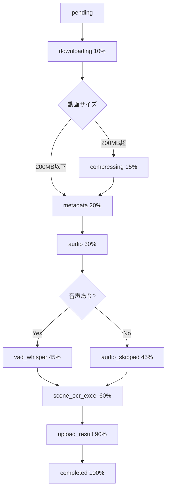
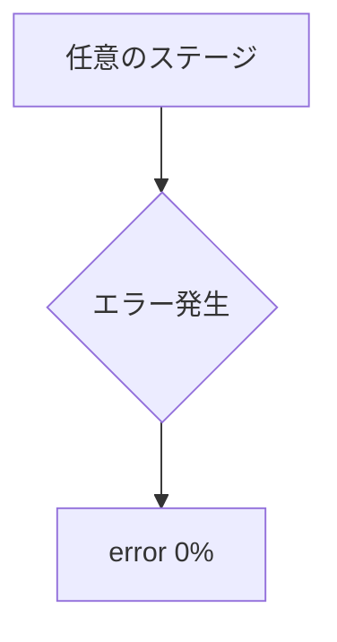

# Processing Status 表示ガイド - Video Analyzer V2

**作成日**: 2025年11月9日
**バージョン**: 2.1.0

---

## 📊 概要

このドキュメントは、Video Analyzer V2アプリケーションの「Processing Status」（処理ステータス）がどのように表示されるかを、条件別・状況別に一覧化したものです。

---

## 🔍 ステータス値の定義

### 1. ProcessingStatusType（メインステータス）

| ステータス値 | 説明 | 主な使用箇所 |
|------------|------|------------|
| `pending` | 初期状態（処理待機中） | initStatus時の初期値 |
| `downloading` | 動画ダウンロード中 | ダウンロード開始時 |
| `processing` | 処理実行中 | メタデータ抽出〜Excel生成 |
| `completed` | 処理完了 | 全処理完了時 |
| `error` | エラー発生 | 処理失敗時 |

**定義場所**: `types/shared.ts:11`

---

## 📍 ProcessingStage（詳細ステージ）

### バックエンドステージ定義（types/shared.ts）

| ステージ値 | 説明 | 進捗% | 条件 |
|-----------|------|-------|------|
| `downloading` | 動画ダウンロード中 | 10% | Blob URLから動画取得 |
| `compressing` | 動画圧縮中 | 15% | 動画サイズが200MB超の場合のみ |
| `metadata` | メタデータ抽出中 | 20% | FFmpegでメタデータ取得 |
| `audio` | 音声検出中 | 30% | 音声ストリーム有無チェック |
| `audio_skipped` | 音声スキップ | 45% | 音声ストリームなしの場合 |
| `vad_whisper` | VAD + Whisper処理 | 45% | 音声ありの場合 |
| `scene_ocr_excel` | シーン検出 + OCR + Excel生成 | 60% | メイン処理 |
| `upload_result` | 結果アップロード中 | 90% | Excelファイルをアップロード |
| `completed` | 完了 | 100% | 全処理完了 |

**定義場所**: `types/shared.ts:13-22`

---

## 🎯 フロントエンド表示ラベル

### ProcessingStatus.tsxの表示文言（getStageLabel関数）

| UI表示ステージ | 表示テキスト（英語） | 対応するバックエンドステージ |
|--------------|-------------------|------------------------|
| `uploading` | "Uploading video..." | - （フロントエンドのみ） |
| `downloading` | "Downloading video from storage..." | `downloading` |
| `metadata` | "Extracting video metadata..." | `metadata` |
| `vad` | "Detecting voice activity..." | `vad_whisper` |
| `audio` | "Extracting audio track..." | `audio` |
| `frames` | "Extracting video frames (scene detection)..." | `scene_ocr_excel` |
| `whisper` | "Transcribing audio with Whisper AI..." | `vad_whisper` |
| `ocr` | "Performing OCR with Gemini Vision..." | `scene_ocr_excel` |
| `excel` | "Generating Excel report..." | `scene_ocr_excel` |
| `upload_result` | "Uploading results..." | `upload_result` |
| `completed` | "Processing completed!" | `completed` |
| `error` | "Processing failed" | `error` |

**定義場所**: `app/components/ProcessingStatus.tsx:158-174`

**注**: フロントエンドのステージは表示用の簡易版です。バックエンドの実際のステージとは必ずしも1対1対応しません。

---

## 🔄 ステータス遷移フロー

### 正常系フロー



### エラー系フロー



---

## 📱 UI表示パターン一覧

### 1. アップロード直後（初期状態）

**バックエンドステータス**:
- `status: 'pending'`
- `progress: 0`
- `stage: 'downloading'` （初期化時に設定）

**フロントエンド表示**:
```
Processing Status: Uploading video...
進捗バー: 0%
```

---

### 2. ダウンロード中

**バックエンドステータス**:
- `status: 'downloading'`
- `progress: 10`
- `stage: 'downloading'`

**フロントエンド表示**:
```
Processing Status: Downloading video from storage...
進捗バー: 10%
```

**ログ出力例**:
```
[upload_1730678901234_abc123xyz] Downloading video from blob...
[downloadFile] Progress: 25.4% (113.2MB / 445.0MB)
[downloadFile] Download complete: 445.0MB
```

---

### 3. 圧縮中（200MB超の場合のみ）

**バックエンドステータス**:
- `status: 'processing'`
- `progress: 15`
- `stage: 'compressing'`

**フロントエンド表示**:
```
Processing Status: Processing your video... This may take several minutes.
進捗バー: 15%
```

**ログ出力例**:
```
[upload_1730678901234_abc123xyz] File size 445.0MB exceeds threshold, starting compression...
[upload_1730678901234_abc123xyz] ✅ Compressed: 445.0MB → 278.3MB (37.4% reduction)
```

---

### 4. メタデータ抽出中

**バックエンドステータス**:
- `status: 'processing'`
- `progress: 20`
- `stage: 'metadata'`

**フロントエンド表示**:
```
Processing Status: Extracting video metadata...
進捗バー: 20%
```

---

### 5. 音声検出中

**バックエンドステータス**:
- `status: 'processing'`
- `progress: 30`
- `stage: 'audio'`

**フロントエンド表示**:
```
Processing Status: Extracting audio track...
進捗バー: 30%
```

---

### 6. VAD + Whisper処理中（音声ありの場合）

**バックエンドステータス**:
- `status: 'processing'`
- `progress: 45`
- `stage: 'vad_whisper'`

**フロントエンド表示**:
```
Processing Status: Transcribing audio with Whisper AI...
進捗バー: 45%
```

**ログ出力例**:
```
[upload_1730678901234_abc123xyz] Processing with VAD + Whisper pipeline...
[upload_1730678901234_abc123xyz] VAD + Whisper complete: 127 segments
[upload_1730678901234_abc123xyz]   Voice ratio: 68.3%
[upload_1730678901234_abc123xyz]   Cost savings: 42.1%
```

---

### 7. 音声スキップ（音声なしの場合）

**バックエンドステータス**:
- `status: 'processing'`
- `progress: 45`
- `stage: 'audio_skipped'`

**フロントエンド表示**:
```
Processing Status: Extracting video frames (scene detection)...
進捗バー: 45%
```

**ログ出力例**:
```
[upload_1730678901234_abc123xyz] ⚠️ No audio stream detected, skipping transcription
```

---

### 8. シーン検出 + OCR + Excel生成中

**バックエンドステータス**:
- `status: 'processing'`
- `progress: 60`
- `stage: 'scene_ocr_excel'`

**フロントエンド表示**:
```
Processing Status: Performing OCR with Gemini Vision...
進捗バー: 60%
```

**ログ出力例**:
```
[upload_1730678901234_abc123xyz] Executing ideal Excel pipeline (Scene-based OCR + Excel)...
[upload_1730678901234_abc123xyz] Detected 24 scenes
[upload_1730678901234_abc123xyz] Scene-based OCR processing...
[upload_1730678901234_abc123xyz] Processing scene 1/24 (timestamp: 0.5s)...
```

---

### 9. 結果アップロード中

**バックエンドステータス**:
- `status: 'processing'`
- `progress: 90`
- `stage: 'upload_result'`

**フロントエンド表示**:
```
Processing Status: Uploading results...
進捗バー: 90%
```

**ログ出力例**:
```
[upload_1730678901234_abc123xyz] Uploading results...
[upload_1730678901234_abc123xyz] Production mode: Uploaded to Blob
[upload_1730678901234_abc123xyz] Result URL (uploadId): upload_1730678901234_abc123xyz
```

---

### 10. 処理完了

**バックエンドステータス**:
- `status: 'completed'`
- `progress: 100`
- `stage: 'completed'`
- `resultUrl: '<uploadId>'`
- `metadata`:
  ```json
  {
    "duration": 120.5,
    "segmentCount": 127,
    "ocrResultCount": 24,
    "transcriptionLength": 3456,
    "totalScenes": 24,
    "scenesWithOCR": 18,
    "scenesWithNarration": 127,
    "blobUrl": "https://..."
  }
  ```

**フロントエンド表示**:
```
✅ Processing Completed!
Excel file download started automatically. If it didn't start, click the button below.

┌─────────────────┬─────────────────┬─────────────────┐
│ Duration        │ Segments        │ OCR Frames      │
│ 120.5s          │ 127             │ 24              │
└─────────────────┴─────────────────┴─────────────────┘

[Download Excel Report] ボタン（緑色）
```

**ログ出力例**:
```
[upload_1730678901234_abc123xyz] Processing completed!
[upload_1730678901234_abc123xyz] Auto-download triggered for uploadId: upload_1730678901234_abc123xyz
```

---

### 11. エラー発生時

**バックエンドステータス**:
- `status: 'error'`
- `progress: 0`
- `error: '<エラーメッセージ>'`

**フロントエンド表示**:
```
❌ Processing Failed
<エラーメッセージ>
```

**例1: ダウンロードエラー**:
```
❌ Processing Failed
Failed to download video: timeout of 300000ms exceeded
```

**例2: Whisper APIエラー**:
```
❌ Processing Failed
Whisper API error: Rate limit exceeded
```

**例3: Gemini APIエラー**:
```
❌ Processing Failed
Gemini Vision API error: Invalid API key
```

---

## 🔍 ステータス取得方法

### フロントエンド → バックエンド

1. **ポーリング**: 10秒間隔で `/api/status/${uploadId}` を呼び出し
2. **認証**: Clerk認証が必須（401エラーで認証失敗）
3. **IDOR保護**: `user_id`と`upload_id`の両方でフィルタリング

**APIエンドポイント**: `/api/status/[uploadId]/route.ts`

**レスポンス例**:
```json
{
  "upload_id": "upload_1730678901234_abc123xyz",
  "user_id": "user_2abc123xyz",
  "status": "processing",
  "progress": 60,
  "stage": "scene_ocr_excel",
  "started_at": "2025-11-09T12:34:56.789Z",
  "updated_at": "2025-11-09T12:36:12.456Z",
  "result_url": null,
  "metadata": null,
  "error": null
}
```

---

## 🎨 UI表示詳細

### 進捗バー

**実装**: `app/components/ProcessingStatus.tsx:272-279`

```tsx
<div className="w-full bg-gray-200 dark:bg-gray-700 rounded-full h-3">
  <div
    className="bg-indigo-600 h-3 rounded-full transition-all duration-500 ease-out relative overflow-hidden"
    style={{ width: `${progress}%` }}
  >
    <div className="absolute inset-0 bg-gradient-to-r from-transparent via-white/30 to-transparent animate-shimmer" />
  </div>
</div>
```

**特徴**:
- アニメーション: シマー効果（光沢）
- 色: インディゴブルー（`bg-indigo-600`）
- ダークモード対応

---

### ステータスメッセージ

**処理中**:
```tsx
<div className="flex items-center justify-center gap-3 p-6 bg-indigo-50 dark:bg-indigo-900/20 rounded-xl">
  <Loader2 className="w-6 h-6 text-indigo-600 dark:text-indigo-400 animate-spin" />
  <p className="text-indigo-900 dark:text-indigo-100 font-medium">
    Processing your video... This may take several minutes.
  </p>
</div>
```

**完了時**:
```tsx
<div className="bg-green-50 dark:bg-green-900/20 border border-green-200 dark:border-green-800 rounded-xl p-6">
  <div className="flex items-start gap-4">
    <CheckCircle2 className="w-6 h-6 text-green-600 dark:text-green-400 flex-shrink-0 mt-1" />
    <div className="flex-1">
      <h3 className="text-lg font-semibold text-green-900 dark:text-green-100 mb-2">
        Processing Completed!
      </h3>
      <p className="text-green-700 dark:text-green-300">
        Excel file download started automatically...
      </p>
    </div>
  </div>
</div>
```

**エラー時**:
```tsx
<div className="bg-red-50 dark:bg-red-900/20 border border-red-200 dark:border-red-800 rounded-xl p-6">
  <div className="flex items-start gap-4">
    <AlertCircle className="w-6 h-6 text-red-600 dark:text-red-400 flex-shrink-0 mt-1" />
    <div>
      <h3 className="text-lg font-semibold text-red-900 dark:text-red-100 mb-2">
        Processing Failed
      </h3>
      <p className="text-red-700 dark:text-red-300">{error}</p>
    </div>
  </div>
</div>
```

---

## 📊 統計情報（メタデータ）

### 表示項目

完了時に以下の統計が表示されます：

| 項目 | 説明 | metadata内のキー |
|------|------|----------------|
| Duration | 動画の長さ（秒） | `duration` |
| Segments | Whisper文字起こしセグメント数 | `segmentCount` |
| OCR Frames | OCR処理したフレーム数 | `ocrResultCount` |
| Total Scenes | 検出したシーン総数 | `totalScenes` |
| Scenes with OCR | OCRテキストありシーン数 | `scenesWithOCR` |
| Scenes with Narration | ナレーションありシーン数 | `scenesWithNarration` |

**定義場所**: `types/shared.ts:24-33`

---

## 🔧 開発モードとプロダクションモードの違い

### ステータス管理

| 環境 | ストレージ | 動作 |
|------|----------|------|
| **開発** | インメモリ（Map） | Supabaseエラーは警告のみ（処理継続） |
| **本番** | Supabase | Supabaseエラーで処理中断 |

**判定条件**: `process.env.NODE_ENV === 'production'` または `process.env.USE_SUPABASE === 'true'`

**実装場所**: `cloud-run-worker/src/services/statusManager.ts:15`

---

## 🚨 エラーハンドリング

### よくあるエラーとステータス

| エラー内容 | ステータス | エラーメッセージ例 |
|-----------|----------|----------------|
| ダウンロードタイムアウト | `error` | `Failed to download video: timeout of 300000ms exceeded` |
| Whisper APIレート制限 | `error` | `Whisper API error: Rate limit exceeded` |
| Gemini API認証エラー | `error` | `Gemini Vision API error: Invalid API key` |
| Supabaseスキーマエラー | `error` | `Supabase schema cache error: Table 'processing_status' not found` |
| RLS違反 | `error` | `Permission denied: Row-level security policy violation` |
| Blob容量超過 | `error` | `Storage quota exceeded for Hobby plan (1GB maximum)` |

**エラーログ出力**: `cloud-run-worker/src/services/errorTracking.ts`

---

## 📝 関連ファイル一覧

### TypeScript型定義
- `types/shared.ts` - フロントエンド型定義
- `cloud-run-worker/src/types/shared.ts` - バックエンド型定義

### UI コンポーネント
- `app/components/ProcessingStatus.tsx` - メインUI表示コンポーネント
- `app/hooks/useVideoProcessing.ts` - 処理フック

### API エンドポイント
- `app/api/status/[uploadId]/route.ts` - ステータス取得API
- `app/api/process/route.ts` - 処理開始API
- `app/api/download/[uploadId]/route.ts` - 結果ダウンロードAPI

### バックエンドサービス
- `cloud-run-worker/src/services/statusManager.ts` - ステータス管理
- `cloud-run-worker/src/services/videoProcessor.ts` - メイン処理ロジック
- `cloud-run-worker/src/services/pipeline.ts` - Excel生成パイプライン
- `cloud-run-worker/src/services/audioWhisperPipeline.ts` - VAD + Whisper処理

### データベース
- `supabase-migrations/001_create_processing_status.sql` - テーブル定義
- `supabase-migrations/002_add_user_id_and_fix_rls.sql` - RLS設定

### テスト
- `__tests__/components/ProcessingStatus.test.tsx` - UIテスト
- `__tests__/hooks/useVideoProcessing.test.ts` - フックテスト
- `cloud-run-worker/src/__tests__/services/statusManager.test.ts` - ステータス管理テスト

---

## 🔄 ポーリング動作

### フロントエンドポーリング仕様

**実装**: `app/components/ProcessingStatus.tsx:74-144`

```typescript
// ポーリング間隔: 10秒
const pollInterval = setInterval(pollStatus, 10000);

// バックアップ: シミュレーション進捗（5秒間隔）
const progressInterval = setInterval(simulateProgress, 5000);
```

**停止条件**:
- ステータスが`completed`になったとき
- ステータスが`error`になったとき

**自動ダウンロード**:
- 完了時に自動的にダウンロード開始（500ms遅延）
- 一度だけ実行（`autoDownloadTriggered`フラグで制御）

---

## 📐 進捗計算ロジック

### バックエンド進捗マッピング

| ステージ | 進捗% | 計算式 |
|---------|-------|-------|
| ダウンロード開始 | 10% | 固定値 |
| 圧縮開始 | 15% | 固定値 |
| メタデータ抽出 | 20% | 固定値 |
| 音声検出 | 30% | 固定値 |
| VAD + Whisper | 45% | 固定値 |
| シーン検出 + OCR + Excel | 60% | 固定値 |
| 結果アップロード | 90% | 固定値 |
| 完了 | 100% | 固定値 |

**注**: 現在は固定値ですが、将来的には各ステージ内での細かい進捗も反映可能です（例: 60% + (scene進捗 / 総シーン数 * 30%)）

---

## 🎬 サンプルシナリオ

### シナリオ1: 音声あり動画（150MB、60秒）

```
1. pending (0%) - 初期化
2. downloading (10%) - ダウンロード開始
3. metadata (20%) - メタデータ抽出
4. audio (30%) - 音声検出
5. vad_whisper (45%) - VAD + Whisper処理（35セグメント生成）
6. scene_ocr_excel (60%) - シーン検出 + OCR（15シーン）
7. upload_result (90%) - 結果アップロード
8. completed (100%) - 完了（自動ダウンロード）
```

**所要時間**: 約2-4分

---

### シナリオ2: 音声なし動画（80MB、30秒）

```
1. pending (0%) - 初期化
2. downloading (10%) - ダウンロード開始
3. metadata (20%) - メタデータ抽出
4. audio (30%) - 音声検出
5. audio_skipped (45%) - 音声スキップ
6. scene_ocr_excel (60%) - シーン検出 + OCR（8シーン）
7. upload_result (90%) - 結果アップロード
8. completed (100%) - 完了（自動ダウンロード）
```

**所要時間**: 約1-2分

---

### シナリオ3: 大容量動画（445MB、120秒）

```
1. pending (0%) - 初期化
2. downloading (10%) - ダウンロード開始（5分）
3. compressing (15%) - 圧縮処理（445MB → 278MB、37.4%削減）
4. metadata (20%) - メタデータ抽出
5. audio (30%) - 音声検出
6. vad_whisper (45%) - VAD + Whisper処理（127セグメント生成）
7. scene_ocr_excel (60%) - シーン検出 + OCR（24シーン）
8. upload_result (90%) - 結果アップロード
9. completed (100%) - 完了（自動ダウンロード）
```

**所要時間**: 約10-15分（ダウンロード + 圧縮に時間がかかる）

---

### シナリオ4: エラー発生（Whisper APIレート制限）

```
1. pending (0%) - 初期化
2. downloading (10%) - ダウンロード開始
3. metadata (20%) - メタデータ抽出
4. audio (30%) - 音声検出
5. vad_whisper (45%) - VAD + Whisper処理開始
6. error (0%) - Whisper APIレート制限エラー
   → エラーメッセージ: "Whisper API error: Rate limit exceeded"
```

**所要時間**: 約30秒-1分（エラーで中断）

---

## 📞 トラブルシューティング

### Q1: ステータスが更新されない

**原因**:
- Supabaseスキーマキャッシュが古い
- RLSポリシーの権限不足
- ネットワークエラー

**確認方法**:
```bash
# Cloud Runログ確認
gcloud run services logs tail video-analyzer-worker --region us-central1

# Supabase Dashboard確認
# → Table Editor → processing_status
```

---

### Q2: 進捗が0%のまま止まる

**原因**:
- バックエンド処理が開始されていない
- `CLOUD_RUN_URL`の設定ミス（改行文字混入など）

**確認方法**:
```bash
# Vercel環境変数確認
vercel env pull .env.vercel
cat .env.vercel | grep CLOUD_RUN_URL

# Cloud Runヘルスチェック
curl https://video-analyzer-worker-820467345033.us-central1.run.app/health
```

---

### Q3: エラーが表示されない

**原因**:
- フロントエンドポーリングがエラーを握りつぶしている
- APIエンドポイントが503エラーをキャッチしている

**確認方法**:
```javascript
// ブラウザコンソールで確認
fetch('/api/status/upload_1730678901234_abc123xyz')
  .then(r => r.json())
  .then(console.log);
```

---

## 📚 参考ドキュメント

- [Video Analyzer V2 - CLAUDE.md](../CLAUDE.md) - プロジェクト概要
- [SYSTEM_ARCHITECTURE_2025-11-04.md](../SYSTEM_ARCHITECTURE_2025-11-04.md) - システムアーキテクチャ
- [SESSION_HANDOFF_2025-11-06.md](../SESSION_HANDOFF_2025-11-06.md) - 最新セッションハンドオフ

---

**ドキュメント作成者**: Claude Code (Anthropic)
**最終更新**: 2025年11月9日
